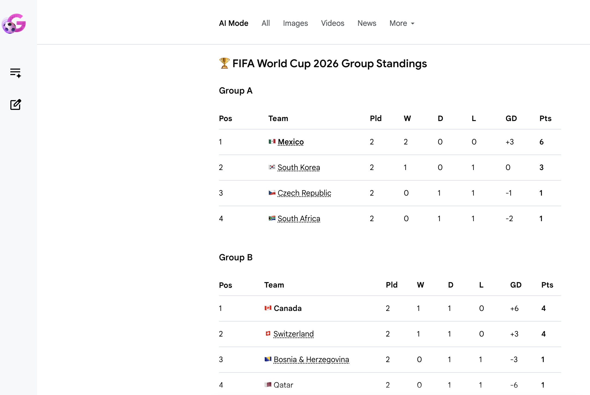
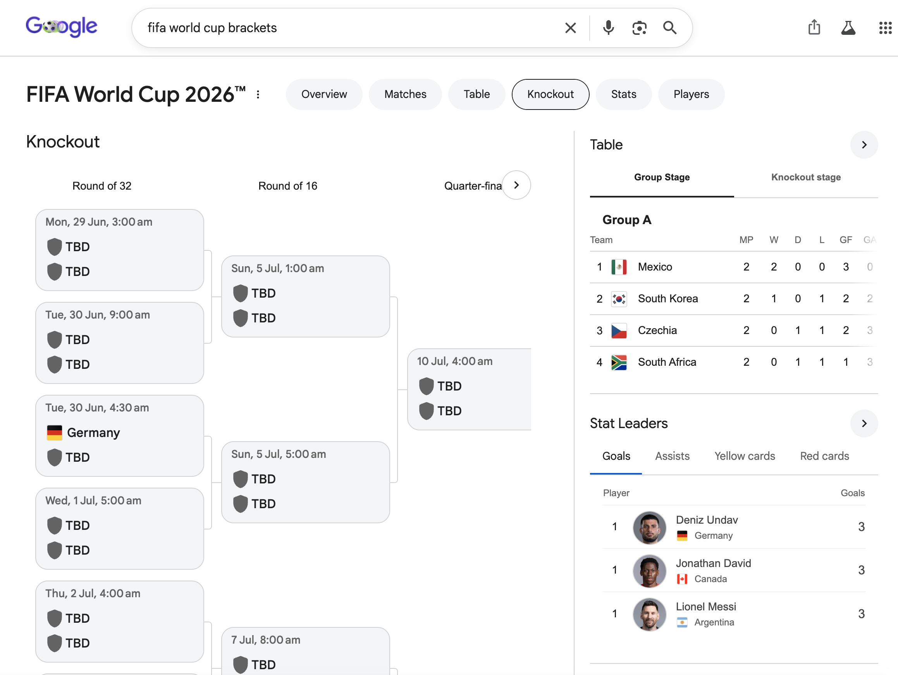

# Why Chat-like GenUI Gets So Much Attention

This chapter builds on several observations from my earlier blog post, [A2UI, AG-UI, and GenUI Beyond the Chat Box](https://2bab.me/en/blog/2026-05-15-a2ui-agui-surface-spec/), and also brings in the [Generative UI case study](https://research.google/blog/generative-ui-a-rich-custom-visual-interactive-user-experience-for-any-prompt/) from Google Research.

In the GenUI space, much of the current attention first lands on chat-like GenUI. Here, chat-like can be understood as a product boundary: the user asks for something in one conversation, the system returns a limited piece of UI, and the user continues through buttons, forms, follow-up actions, or another message. I recorded this point in that earlier post:

> A2UI and AG-UI are still clearly centered around a **chat-like style** today

Looking back, the commercial motivation is quite visible: it overlaps with where the world's attention already is. But this chapter is more interested in another angle, the sort of thing a field note should look at: chat-like GenUI can compress the complexity of generative UI into one conversation, one card, one panel, or one response. That makes it a useful starting point.

## Complexity Inside One Conversation

A chat-like GenUI response usually does not need to generate a complete app. More often, it becomes a recommendation list, comparison table, information card, confirmation button, or chart. For many AI Native products, this scope is comfortable: the UI has a short lifecycle, state does not need to travel across pages, and users can quickly accept it as a richer extension of Markdown. This is a technical analogy, but ordinary users usually do not care what technology is underneath; cognitively, it just feels like a smoother rich response.

Thus, it directly affects engineering. Components can be predefined, layouts can be limited to a few combinations, and actions can start from low-risk moves such as "show me more options", "expand details", or "send this choice back to the assistant". When a single response is not too complex, predefined components at the product or industry layer are often enough to produce a usable experience.

C1, OpenUI, A2UI, and AG-UI may point in different directions, but many demos are doing something similar: provide a component catalog, schema, action types, and style presets first, then let the model assemble within that set. The model is responsible for composition inside a boundary. The main structure of the product UI still belongs to the host application.

## Schema and Runtime

A2UI / AG-UI is a useful light reference here. I previously summarized their relationship like this:

> A2UI is closer to a payload/schema, while AG-UI is closer to a runtime pipe.

This distinction helps explain why chat-like GenUI becomes an early landing point. A2UI cares about what UI the agent wants to show: which components to use, what data is bound, and what actions are exposed. AG-UI cares about how the agent and frontend keep communicating: how text streams out, how tool calls enter the UI, how user confirmation returns to the agent, and how state updates reach the frontend.

In a chat-like scenario, both layers can converge more easily. The payload does not need to cover the full information architecture of the product, and the runtime mainly revolves around one task. The amount of state, components, and actions is limited, so testing and rollback are also easier to handle.

## Beyond the Chat Box

The chat box is only one entry point. In the same earlier post, I also wrote:

> News apps still need reading pages, podcast apps still need show notes, magazines still need features...

These scenarios are closer to a general GenUI shape. The problem expands from "generate a piece of UI inside one conversation" to "let the content surfaces inside existing products understand content, state, and user intent", then dynamically organize layout, recommendations, comments, sharing, ads, related reading, and action entry points.

Google Research pushed this form further in its [Generative UI article](https://research.google/blog/generative-ui-a-rich-custom-visual-interactive-user-experience-for-any-prompt/) published on 2025-11-18. The original article says this implementation dynamically creates visual experiences and interactive interfaces, with examples including `web pages, games, tools, and applications`, automatically designed and customized in response to any question, instruction, or prompt. In **Dynamic View**, Google says Gemini designs and codes `a fully customized interactive response` for each prompt. The implementation section says it uses Gemini 3 Pro, plus tool access, system instructions, and post-processing. I understand this as a freer GenUI direction in relation to the discussion above.

*Source: Google Research, an AI Mode / dynamic view example video from the article.*

This direction is closer to "free-form" GenUI, but from the product surfaces I can currently observe, it has not become a generally available entry point after broad experimentation. In the Google Search + AI Mode experience I can open today, I have not been able to reproduce the kind of complete Dynamic View shown in the article. What remains stable and observable is the more traditional dynamic component system in Google Search: for example, World Cup queries can show schedules, standings, knockout brackets, and player stats.

The two screenshots below illustrate the difference. Around similar World Cup information, AI Mode is closer to rendering a Markdown table, while the regular Google Search results page already has a clear vertical UI, including tabs, a bracket, standings, and player data.

This line is worth watching. It can start from a traditional BDUI model: the backend recognizes verticals such as the World Cup, weather, stocks, flights, or recipes from the query, then sends down a set of controlled components. Traditional ML / search-and-ranking systems can decide which modules appear, how they are ordered, and which data is more reliable. The UI is already dynamic, but its dynamism mainly comes from strict structured data, business templates, and search/ranking systems.

Once LLMs enter this route, it can gradually gain more freedom. The landing difficulty of general GenUI will still be much higher. Pages have longer lifecycles, state may need to persist across pages, design systems must continuously constrain model output, and testing can no longer look only at whether one response is reasonable. Product teams also need to answer a harder question: which parts may be generated, which parts must remain stable, and which actions require explicit permission and rollback.

This is why chat-like GenUI is a useful entry point. It compresses the generative UI problem into a controllable range: limited components, limited state, limited actions, and limited lifecycle. Once these pieces can work steadily inside one conversation, moving toward full pages, native apps, and more general content surfaces may turn the problem into a long-term design question around the UI expression layer and UI runtime.

## Platform and Technical Options

Finally, a note on platform technology choices. Many AI Native products today are visibly more Web Frontend oriented, and one important reason is that the Web has fewer restrictions around "dynamic" behavior. GenUI becomes more constrained once multiple platforms enter the picture, mainly because Android and iOS native apps cannot download and execute native code at runtime. On mobile, such requirements usually have to go through controlled components, BDUI, or RN-like solutions that are closer to a Web runtime. This is also why many things are first tested on the Web: it echoes the idea at the beginning of this chapter, starting from a more controlled surface and finding a practical technical path. Chat-like GenUI is one such surface. Of course, many e-commerce apps have long used RN or other dynamic frameworks for campaign slots and feed cells on their home pages; that experience is still relevant to GenUI.

## References

- [Generative UI: A rich, custom visual interactive user experience for any prompt @ Yaniv Leviathan, Dani Valevski, Vishnu Natchu, Yossi Matias](https://research.google/blog/generative-ui-a-rich-custom-visual-interactive-user-experience-for-any-prompt/)
- [A2UI, AG-UI, and GenUI Beyond the Chat Box @ 2BAB](https://2bab.me/en/blog/2026-05-15-a2ui-agui-surface-spec/)
