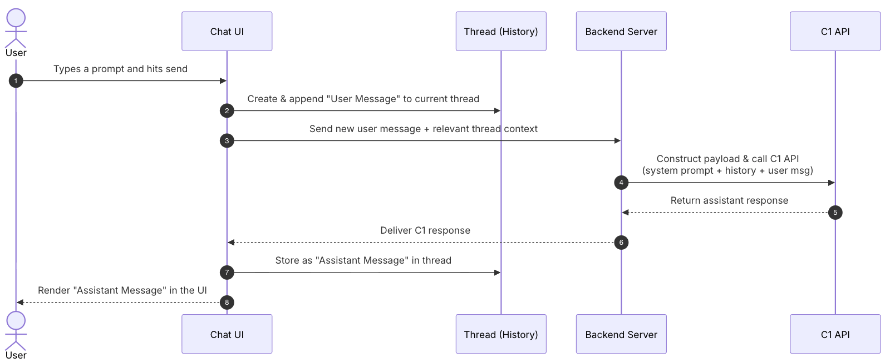
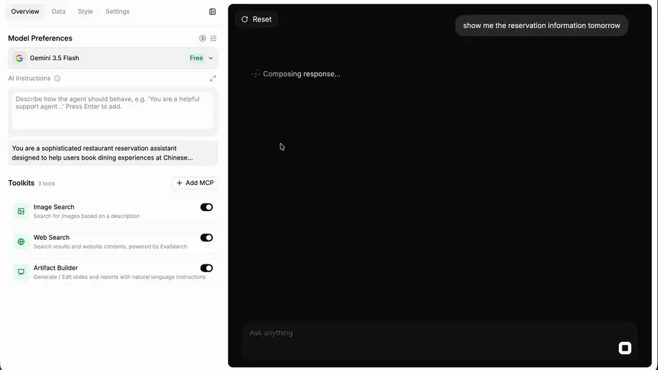
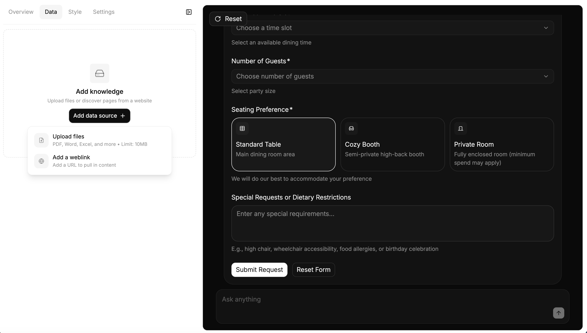
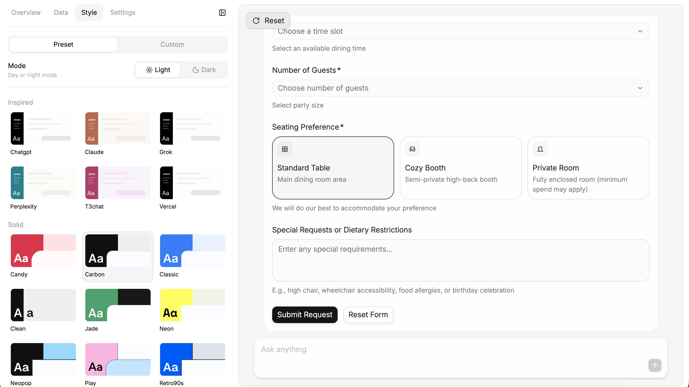
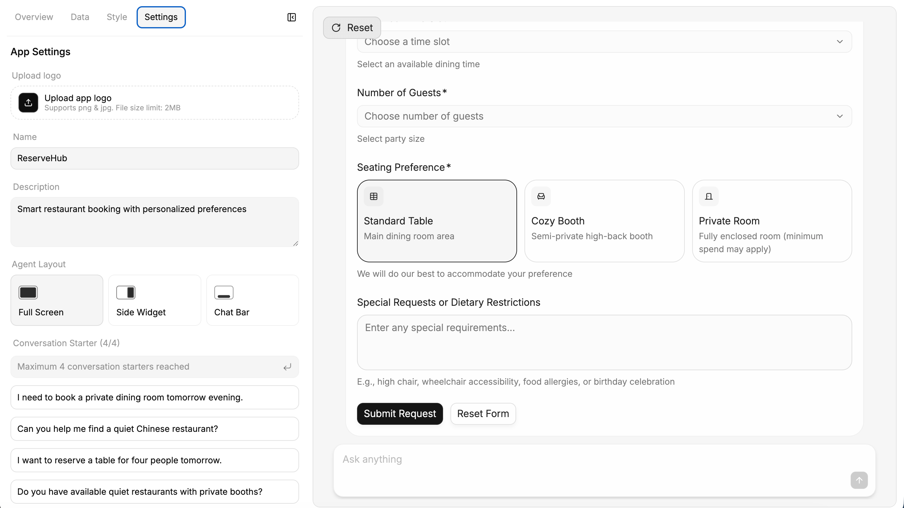
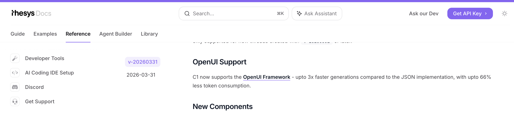
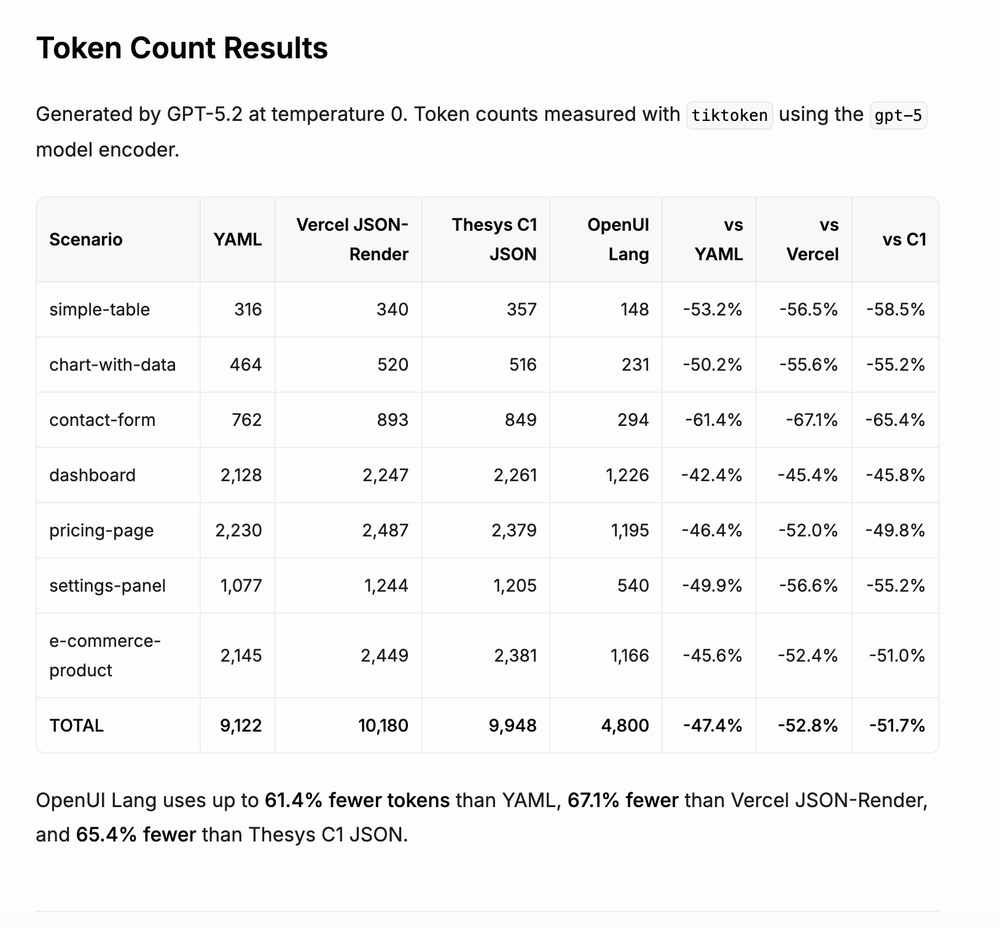
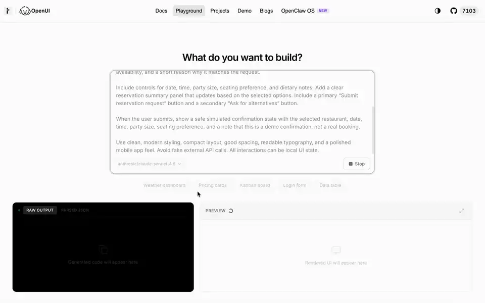

# OpenUI and Thesys C1

Thesys is a startup based in San Francisco. Its website describes the company as [The Generative UI Company](https://www.thesys.dev/). It mainly works around UI generation, the Reports API, Agent Builder, and OpenUI Cloud. It is worth watching here because it gives us two connected clues at the same time: a commercial product and an underlying open-source UI framework.

## The Current Commercial Product: C1

C1 is part of Thesys's commercial GenUI API & Components product line. According to the flow chart in the official docs, the backend calls the C1 service through an OpenAI-compatible API format, receives a C1 Response, and passes it to `<C1Component>` or `<C1Chat>` on the frontend to render an interactive UI.



The shape is close to a mediated provider layer. Thesys's [pricing page](https://www.thesys.dev/pricing) also points in that direction: it has a separate C1 usage plan, shows the major LLM providers used underneath, and emphasizes "no markups" compared with LLM providers. Additional models are routed through OpenRouter.

The black area in the following screenshot is a `thesys-agent` demo widget created in Thesys Console. It can be embedded into customer pages and represents one of the product shapes Thesys is pushing, namely chat-like products.



From the Console side, C1 is more than a model API. It also includes a product interface for business-side agent configuration. In this interface, users can configure data sources, visual presets, application name, description, layout, and conversation starters, while previewing the generated interactive UI on the right.







## The Appearance of OpenUI

Judging by public release timing, OpenUI is the expression layer and runtime that Thesys later open sourced. The official docs split it into Library, Prompt Generator, Parser, and Renderer: an application defines a component library, generates a system prompt, the model outputs OpenUI Lang, and then the parser and renderer turn it into React UI. OpenUI and C1 have a visible upstream/downstream relationship:





From the two official screenshots, C1 appears to have used JSON as its earlier output format. After OpenUI Lang appeared, Thesys claimed up to 3x faster generation and up to 66% less token consumption. According to the [C1 API Changelog](https://docs.thesys.dev/api-reference/model-changelog), starting from API version `v-20260331`, C1's response format switched to OpenUI as a backwards-incompatible change, while older versions and threads stay on JSON. As a side note, Thesys Console now labels C1 as "OpenUI Cloud (prev C1)", so the two lines are also converging in naming.

## From Prompt to OpenUI Lang



The animation above corresponds to a simulated restaurant booking scenario, running on the official OpenUI Playground (model: anthropic/claude-sonnet-4.6). The system prompt breakdown and raw output below come from a local demo of the same scenario, with Gemini as the model. The original business prompt is short. It mainly gives a few constraints: `mobile-first restaurant reservation interface`, `quiet Chinese restaurant for 4 people tomorrow evening`, and a `safe simulated confirmation state` after submission. These are enough to describe the scenario, but for the model to produce UI that the renderer can consume, OpenUI needs to add a stricter output contract in the system prompt.

In the local demo, I roughly saw this prompt as three layers:

- **OpenUI's base output rules**: first, the model's output channel is narrowed to `openui-lang`. The entry point must be named `root`; each line follows `identifier = Expression`; and the final answer must not be wrapped in Markdown, JSON, HTML, or code fences.  
  Examples: `Your ENTIRE response must be valid openui-lang code`; `root is the entry point`.
- **The complete schema expanded from the component library**: this is the largest part of the prompt. It gives the model the components known by the runtime, parameter order, field types, action expressions, `$binding`, form validation rules, and so on. Whether `CardHeader`, `TextContent`, `Carousel`, `Form`, `Button`, and `FollowUpBlock` can be called correctly mostly depends on whether this schema is clear enough.  
  Examples (signatures simplified): `Button(label, action?, variant?)`; `Carousel([[title, image, description, tags], ...])`.
- **The task constraints added by the demo**: only then comes the restaurant booking scenario itself. It asks the model to prefer built-in OpenUI chat components, simulate confirmation after submission, and not claim that a real reservation has been made. In a real agent setup, the rules would be different. Some buttons may use `Action([@ToAssistant(...)])` to turn a click into the next assistant turn; that mechanism fits low-risk actions such as "show me other options", "continue explaining", or "help me compare". A `Submit reservation request` should not merely continue the conversation. The UI runtime should read the form values, trigger a clear business action or mutation, let the backend handle inventory and permissions, and return the resulting state to the frontend. The model can help generate the next screen's copy and explanation, but reservation success should be determined by the business system.  
  Examples: `quiet Chinese restaurant for 4 people tomorrow evening`; `do not claim a real booking was made`.

After the three main layers, the generated prompt also includes few-shot examples. These are basically small OpenUI Lang programs showing how to organize "table + follow-up", "clickable list", "image carousel", and "form validation". Finally, it shows what a complete output roughly looks like: define `root` first, then fill in titles, lists, forms, buttons, and data one by one.

The final raw output looks like a definition table. Here are the first dozen lines:

```txt
root = Card([header, introCallout, sectionTitle1, restaurantCarousel, sectionTitle2, bookingForm, summaryCallout, followUps])

header = CardHeader("AI Table Finder", "Personalized recommendations & instant booking")

introCallout = Callout("info", "Match Found", "We found 3 quiet Chinese restaurants with private rooms available tomorrow evening for 4 people.")

sectionTitle1 = TextContent("Recommended Restaurants", "large-heavy")

restaurantCarousel = Carousel([[r1_title, r1_img, r1_desc, r1_tags, r1_btn], [r2_title, r2_img, r2_desc, r2_tags, r2_btn], [r3_title, r3_img, r3_desc, r3_tags, r3_btn]], "card")

r1_title = TextContent("The Jade Pavilion", "large-heavy")
r1_img = ImageBlock("https://picsum.photos/seed/jadepavilion/800/500", "Elegant Chinese dining room")
r1_desc = TextContent("A serene sanctuary specializing in Cantonese fine dining. Highly rated for its whisper-quiet atmosphere and exquisite dim sum.", "default")
r1_tags = TagBlock(["0.8 miles", "Rating: 4.9", "Noise: Quiet", "Private Room: Yes"])
r1_btn = Button("Select Jade Pavilion", Action([@ToAssistant("I want to select The Jade Pavilion")]))
```

It lists the top-level structure and several reference names first, then fills in concrete definitions such as `header` and `restaurantCarousel`. This order matters to OpenUI: the parser can accept unresolved references first, then resolve them as later chunks arrive. In other words, OpenUI Lang is designed for streaming rendering. It does not need to wait until an entire JSON tree has fully closed before work can begin, although there are of course other ways to solve this problem.

## References

- [Thesys Introduces C1 to Launch the Era of Generative UI @ Thesys](https://www.businesswire.com/news/home/20250418761213/en/Thesys-Introduces-C1-to-Launch-the-Era-of-Generative-UI): the public C1 announcement on 2025-04-18.
- [Conversational UI Concepts @ Thesys](https://docs.thesys.dev/guides/conversational/concepts#the-flow-of-a-conversation): the conversation flow diagram in Thesys's official docs.
- [Thesys @ Product Hunt](https://www.producthunt.com/products/thesys): the Product Hunt records for C1 on 2025-09-30 and OpenUI on 2026-03-11.
- [Why We're Open Sourcing OpenUI @ Rabi](https://www.thesys.dev/blogs/openui): Thesys's OpenUI open-source announcement on 2026-03-11.
- [API Changelog @ Thesys](https://docs.thesys.dev/api-reference/model-changelog): the changelog entry where C1's response format moved to OpenUI starting from `v-20260331`.
- [OpenUI GitHub Repo @ thesysdev](https://github.com/thesysdev/openui): the OpenUI repository. The repo creation date predates the public release and is useful as code-history context.
