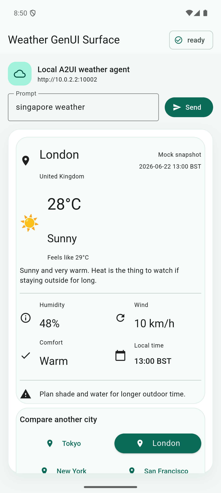

# Google A2UI and Its Surrounding Work

This chapter narrows the scope to A2UI as a protocol-level expression. It does not cover the Dynamic View that Google Research has shown in AI Mode. A2UI's own definition is direct:

> A2UI (Agent to UI) is a declarative UI protocol for agent-driven interfaces.

The official docs further explain that A2UI lets agents generate JSON messages, and clients render those messages with their own native components across Web, mobile, and desktop, while avoiding arbitrary code execution. Three words matter here: `declarative`, `messages`, and `native components`. Its main route is to turn "what should be shown" into structured intent, then hand that intent to a renderer inside the host application. Asking a model to write temporary frontend code, or putting an iframe into the host app, belongs to the alternative routes A2UI compares against. They are not what A2UI is trying to do.

## Core Concepts

When reading the A2UI docs, these concepts are the easiest starting point:

- `Surface`: a UI region that an agent can create, update, or delete.
- `Catalog`: a declaration of which components the client supports, and what parameters those components accept.
- `Component`: a concrete UI element, such as `Text`, `Button`, `Card`, or `TextField`.
- `Data Model`: a state tree stored on the client. Components can bind to its values through paths.
- `Action`: the entry point for user clicks, submissions, selections, and other events that need to return to the agent or server.

After A2UI separates these objects, generative UI is no longer just "some text that can be rendered". It looks more like a sequence of ordered updates: create a surface first, add component structure, fill in data, then let later user actions continue through the same chain.

## What Gets Generated

In the current v0.9 / v0.9.1 shape documented by A2UI, server-to-client output mainly revolves around four message types: `createSurface`, `updateComponents`, `updateDataModel`, and `deleteSurface`. The official site currently marks v0.9.1 as Current, while v1.0 is still under Candidate. The demo below uses the A2UI v0.9 path currently supported by Flutter GenUI.

The official Data Flow page describes A2UI output as a sequence of JSON messages. In streaming scenarios, these messages are often transmitted as JSONL, one object per line. If those messages are wrapped into a normal JSON array and returned only after the whole UI has been generated, non-streaming A2A calls or plain HTTP JSON can easily become a long wait, and may even run into gateway or platform timeouts. A2UI is therefore a better fit for A2A streaming, SSE, WebSocket, or similar transports that can push messages one by one, so the client can create a surface first, then fill in data and components.

A minimal shape looks roughly like this:

```jsonl
{"version":"v0.9","createSurface":{"surfaceId":"weather","catalogId":"https://a2ui.org/specification/v0_9/basic_catalog.json"}}
{"version":"v0.9","updateDataModel":{"surfaceId":"weather","path":"/","value":{"city":"Singapore","temperature_c":26}}}
{"version":"v0.9","updateComponents":{"surfaceId":"weather","components":[{"id":"root","component":"Column","children":["title"]},{"id":"title","component":"Text","text":{"path":"/city"}}]}}
```

The difference from OpenUI is easy to see. OpenUI output is closer to this:

```txt
root = Stack([header, filterCard, restaurantSection])
header = Card([headerTitle], "clear")
headerTitle = TextContent("Reserve a Table", "large-heavy")
```

A2UI chooses a clearer JSON envelope. The component structure is a flat component list. Each component has its own `id`, and parent components refer to children by child id. This makes local updates cheaper: updating one component or appending some data can become a local message, without resending a deeply nested tree.

This also sets up Chapter 6. If the question is only "what did the model generate", OpenUI and A2UI already give two very different answers. OpenUI is closer to a DSL program. A2UI is closer to a traditional BDUI message format with a streaming-oriented shape.

## Cross-Platform Is A2UI's Distinctive Point

A2UI puts portability near the front of its documentation: the same agent response can be mapped by different renderers to local UI on Web, mobile, and desktop. Flutter GenUI's README also says:

> The Flutter Gen UI SDK uses the A2UI protocol

Native Android and iOS apps are usually not good places to dynamically deliver executable code, especially native code. Feasible paths often involve a JavaScript runtime, or quietly embedding a custom interpreter such as Lua. That is a large constraint for OpenUI. A2UI instead asks the server or agent to send declarative data, and the renderer maps that data locally into Flutter widgets, SwiftUI views, Jetpack Compose composables, or Web components.

It gives mobile apps a relatively clear engineering path: the UI can be dynamically assembled, while executable code and component implementations still belong to the client. By comparison, OpenUI / Thesys C1 currently lands more naturally on the Web / React route. Mapping the same OpenUI Lang smoothly to Kotlin / Swift native components is not just an interpreter problem; it also brings more semantic and platform-runtime integration work.

A2UI does not magically solve cross-platform consistency. Once the catalog becomes complex, component behavior, layout details, accessibility, theming, and error recovery all need to be tested separately across renderers.

## Surrounding Ecosystem

A2UI itself is only a UI payload / schema / renderer contract. Real product integration still needs surrounding pieces.

One common companion is AG-UI. AG-UI is closer to a runtime / event pipe. It handles agent execution, text streams, tool calls, state, user input, and related events. CopilotKit can then connect AG-UI and A2UI into React / Next applications. This split makes the roles clearer: A2UI describes what UI should be shown; AG-UI keeps the agent and frontend communicating; projects such as CopilotKit and Flutter GenUI connect the pieces to concrete application frameworks.

## Flutter Weather Card Demo

To see what A2UI looks like on mobile, I previously built a local Flutter weather demo. The server in this demo also does not generate Flutter code on the fly. The Flutter app connects to a Python A2A server through `genui` / `genui_a2a`; the server returns text and A2UI data parts based on mock weather data; Flutter then renders them into native widgets through `SurfaceController`.



The flow can be reduced to a few steps:

```text
Flutter App
  -> A2uiAgentConnector
  -> Python A2A weather server
  -> mock weather lookup
  -> text + A2UI data parts
  -> SurfaceController
  -> Flutter widget tree
```

When the client sends a request, it puts A2UI capability information into A2A message metadata, telling the server that it supports the v0.9 basic catalog:

```json
{
  "metadata": {
    "a2uiClientCapabilities": {
      "v0.9": {
        "supportedCatalogIds": [
          "https://a2ui.org/specification/v0_9/basic_catalog.json"
        ]
      }
    }
  }
}
```

Here, `catalogId` can be understood as the "component dictionary" used by this surface. The client declares through `supportedCatalogIds` that it understands this basic catalog, and the server selects the same ID in `createSurface.catalogId`. Later component names and properties in `updateComponents`, such as `Column`, `Card`, `Button`, and `Icon`, are interpreted according to that catalog. It does not ask the client to dynamically download code. It aligns both sides on the same set of renderable components and parameter conventions.

The server finally returns 4 parts. The first one is plain text, followed by three A2UI data parts. The outer A2A task / status fields are omitted here; this excerpt only shows the `parts` inside the final message:

```json
{
  "parts": [
    {
      "kind": "text",
      "text": "Singapore: Mostly cloudy, 26°C (feels like 29°C)."
    },
    {
      "kind": "data",
      "data": {
        "version": "v0.9",
        "createSurface": {
          "surfaceId": "weather",
          "catalogId": "https://a2ui.org/specification/v0_9/basic_catalog.json",
          "sendDataModel": true
        }
      }
    },
    {
      "kind": "data",
      "data": {
        "version": "v0.9",
        "updateDataModel": {
          "surfaceId": "weather",
          "path": "/",
          "value": {
            "city": "Singapore",
            "country": "Singapore",
            "temperature_c": 26,
            "condition": "Mostly cloudy",
            "humidity": 82,
            "wind_kph": 13,
            "feels_like_c": 29
          }
        }
      }
    },
    {
      "kind": "data",
      "data": {
        "version": "v0.9",
        "updateComponents": {
          "surfaceId": "weather",
          "components": [
            {
              "id": "root",
              "component": "Column",
              "align": "stretch",
              "children": ["heroCard", "cityCard"]
            },
            {
              "id": "heroCard",
              "component": "Card",
              "child": "heroBody"
            },
            {
              "id": "temperatureText",
              "component": "Text",
              "variant": "h1",
              "text": "26°C"
            },
            {
              "id": "londonButton",
              "component": "Button",
              "variant": "borderless",
              "child": "londonButtonChild",
              "action": {
                "event": {
                  "name": "select_city",
                  "context": {
                    "city": "London"
                  }
                }
              }
            }
          ]
        }
      }
    }
  ]
}
```

The last `updateComponents` part is the main UI structure. The JSON above only keeps a few key components to control length. The real message in the local demo contains 66 components, forming the main weather card, city information, temperature, humidity, wind speed, comfort indicator, reminder text, and city-switching buttons. After Flutter receives `CreateSurface`, `UpdateDataModel`, and `UpdateComponents`, it sends the messages to `SurfaceController`, and the renderer builds the widget tree starting from `root`.

Buttons use the same chain. When the user taps London, Flutter sends an A2UI action data part with the action name, source component, and city argument:

```json
{
  "version": "v0.9",
  "action": {
    "name": "select_city",
    "sourceComponentId": "londonButton",
    "context": {
      "city": "London"
    },
    "surfaceId": "weather"
  }
}
```

The server recognizes `select_city`, looks up London's mock weather, then returns a new `updateDataModel` and `updateComponents`. After Flutter re-renders, the main card changes to London and `londonButton.variant` becomes `primary`. A small IO task is enough to show the rest of the chain: receive a user action, update data, replace components, and render again.

## References

- [What is A2UI? @ A2UI](https://a2ui.org/introduction/what-is-a2ui/)
- [Data Flow @ A2UI](https://a2ui.org/concepts/data-flow/)
- [Components & Structure @ A2UI](https://a2ui.org/concepts/components/)
- [Transports @ A2UI](https://a2ui.org/concepts/transports/)
- [Flutter GenUI @ GitHub](https://github.com/flutter/genui)
- [A2UI @ GitHub](https://github.com/google/A2UI)
