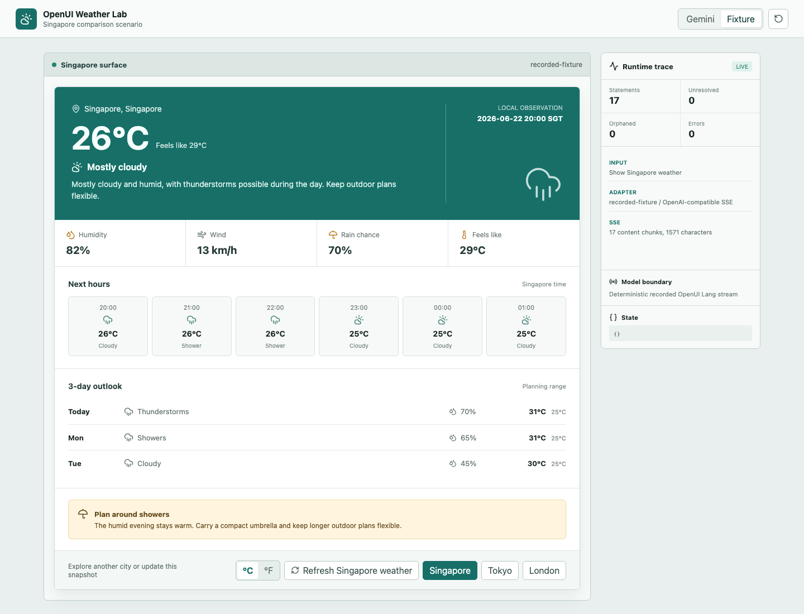
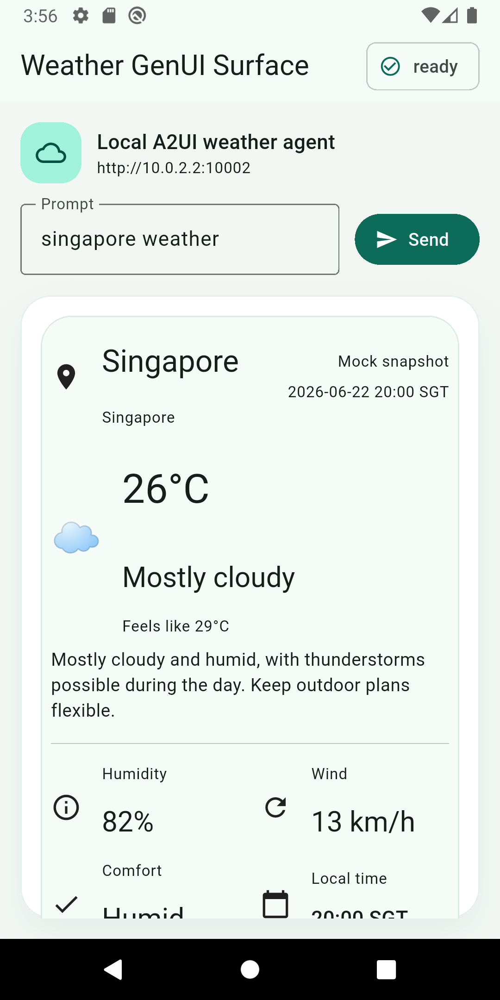

# Comparing Framework Outputs at UI Generation Time

The preceding chapters focused on what each framework or protocol does and roughly how a GenUI product works, with a few demos along the way. Starting with this chapter, we move one level deeper into the implementation. First, the UI generation stage: given the same Singapore weather snapshot, what do OpenUI and A2UI produce before the renderer? Vercel has less material at this layer, so it is left out of this chapter.

The OpenUI weather demo exposes 10 weather-domain components. Gemini 3.5 Flash generates OpenUI Lang, which is then handed to a React renderer:



The A2UI weather demo uses the v0.9 Basic Catalog. Gemini 3.5 Flash generates A2UI messages, the server validates them, and a Flutter renderer consumes the result:



Both demos use the same fixed data: Singapore, 26°C, feels like 29°C, 82% humidity, and 13 km/h wind. Both also retain the real Gemini request, raw SSE, and final output. This lets us inspect the two generation contracts directly, while observing how the same model responds to two expression formats. We deliberately gave OpenUI more semantic, coarse-grained components and A2UI more atomic ones so we could compare their behavior along that dimension. The comparison is therefore not a fully controlled experiment.

## What the Generation Side Receives First

Before a model can generate UI, it needs to know which components it may use and what output format it must follow.

OpenUI expands the component library into a system prompt. The weather experiment registers 10 components, including `WeatherCanvas`, `WeatherHero`, `MetricGrid`, `HourlyForecast`, `DailyForecast`, `UnitToggle`, and `ActionButton`. The final system prompt is about 8,900 characters, or 2,205 tokens when counted with the GPT-5 tokenizer. It mainly contains four parts:

1. OpenUI Lang syntax, such as one `identifier = Expression` statement per line and `root` as the entry point.
2. Component signatures, parameter order, and field types.
3. State, action, and data rules such as `$unit`, `@Set`, `@ToAssistant`, and `Query()`.
4. A complete few-shot example of a weather UI.

The user message for this run contains only `Show Singapore weather` and a fixed weather snapshot. The model selects components according to the system prompt. The internal layout and styling of each React component still come from application code.

A2UI starts with the client declaring which catalog it supports:

```json
{
  "a2uiClientCapabilities": {
    "v0.9": {
      "supportedCatalogIds": [
        "https://a2ui.org/specification/v0_9/basic_catalog.json"
      ]
    }
  }
}
```

The `catalogId` is the component dictionary shared by the client and agent. The client uses it to say, "these are the components I can render." The agent or generation middleware then organizes the protocol schema, catalog, and generation rules for the model. A2UI defines the communication contract; each agent implementation decides how to construct its system prompt.

The A2UI system prompt in this experiment is a generation contract trimmed for the weather demo. It contains 9,466 characters, or 2,323 tokens, and mainly has four parts:

1. The order and fixed fields of the three messages: `createSurface`, `updateDataModel`, and `updateComponents`.
2. Property constraints for seven Basic Catalog primitives: `Card`, `Column`, `Row`, `Text`, `Icon`, `Divider`, and `Button`.
3. Rules for component IDs, references, data, actions for four cities, and a two-buttons-per-row layout on narrow screens.
4. A complete 66-component Tokyo few-shot example.

A user message for one turn contains the current request plus the full weather snapshot. In this demo, that message is 542 characters, or 150 tokens. After the model generates JSONL, the server validates the catalog, message order, data, component tree, and actions, then hands the three validated messages to A2A.

These starting points already reveal one engineering difference. An OpenUI generation contract usually ships together with the Web service and component library. An A2UI catalog is also constrained by client versions, so the server first needs to know what the current Android, iOS, or Flutter client can render.

## First Generation: OpenUI Lang and A2UI Messages

OpenUI returns a UI program with `root` as its entry point. The real Gemini output in this run contains 17 statements and begins like this:

```text
root = WeatherCanvas([hero, metrics, hourly, daily, advisory, controls])
$unit = "c"
hero = WeatherHero("Singapore", "Singapore", "2026-06-22 20:00 SGT", 26, 29, "Mostly cloudy", "Mostly cloudy and humid...", $unit)
metrics = MetricGrid([humidity, wind, rain, heat])
```

The first line lists the main sections of the UI tree. Later statements fill in `hero`, `metrics`, `controls`, and the other references. Components use positional parameters, while field names live in the component signature, so the model does not repeat them on every call.

A2UI returns several ordered messages. The excerpt below keeps only the main fields of each message:

```jsonl
{"version":"v0.9","createSurface":{"surfaceId":"weather","catalogId":".../basic_catalog.json"}}
{"version":"v0.9","updateDataModel":{"surfaceId":"weather","path":"/","value":{"city":"Singapore","temperature_c":26}}}
{"version":"v0.9","updateComponents":{"surfaceId":"weather","components":[{"id":"root","component":"Column","children":["heroCard","cityCard"]}]}}
```

`createSurface` establishes a UI region that can receive further updates. `updateDataModel` writes data, and `updateComponents` writes the component tree with stable IDs. Structure, data, and the Surface lifecycle each have their own place in the protocol.

After removing unnecessary whitespace from the real artifacts and counting them with the same `tiktoken.encoding_for_model("gpt-5")` method used by OpenUI's official benchmark, the results are:

|Local capture|Characters|GPT-5 tokenizer|Output size|
|:---|---:|---:|:---|
|OpenUI: real Gemini Singapore output|1,467|432 tokens|17 statements|
|A2UI: real Gemini Singapore output|6,747|1,633 tokens|3 messages, 66 components|

Both rows are real Gemini 3.5 Flash output. OpenUI uses about 73.5% fewer tokens in this run. Of A2UI's 1,633 tokens, the single `updateComponents` message accounts for 1,482. Most of that output describes IDs, types, properties, and references for 66 primitive components.

OpenUI also treats token efficiency as a major design goal of OpenUI Lang. Its official benchmark uses GPT-5.2 across seven scenarios, first generating OpenUI Lang and then converting the same AST into Vercel JSON-Render and Thesys C1 JSON. The totals are 4,800 tokens for OpenUI Lang, 10,180 for Vercel, and 9,948 for C1, reductions of 52.8% and 51.7% respectively. In the contact form scenario, the largest reduction is 67.1%. That official benchmark covers Vercel and C1; the A2UI numbers in this chapter come from a separate weather experiment.

OpenUI uses fewer output tokens for the first generation here. Two factors contribute to the result. Positional parameters and references make OpenUI Lang more compact than JSON, and this OpenUI demo uses weather-domain components while the A2UI demo uses Basic Catalog primitives. The experiment preserves the more natural usage of each framework, so it measures the cost of each complete generation contract. Isolating the language format alone would require another run with identical component granularity. I therefore use the official result, roughly a 50% reduction, as the main reference. Our demo did not lock the UI design tightly enough to be a controlled comparison.

## Component Granularity: Selecting a Card or Laying Out the UI

OpenUI's `WeatherHero(...)` already contains the city, temperature, weather icon, feels-like value, and summary. The model invokes it once, and the React renderer expands it into the full hero region.

The A2UI Basic Catalog only contains primitives such as `Card`, `Column`, `Row`, `Text`, `Icon`, `Divider`, and `Button`. The same hero needs separate definitions for `heroCard`, `heroBody`, `locationRow`, `temperatureRow`, and each Text node. This run uses 66 components in total, with the single `updateComponents` message accounting for 1,482 tokens.

The difference between 432 and 1,633 therefore reflects both DSL format and component granularity. If the A2UI catalog exposed a predefined `WeatherCard`, the component count and payload would shrink substantially. If OpenUI exposed only primitives such as `Stack`, `Text`, and `Icon`, it would need to produce more statements as well.

Component granularity decides how much design work the model performs. With Semantic Components, the model chooses which weather card to use. With primitives, the model also decides which Rows, Columns, and Text nodes appear inside the card. The first route is easier to stabilize. The second preserves more layout freedom, with additional costs in tokens, generation validation, and visual testing.

The first A2UI run produced a concrete example of that cost. Gemini generated 70 components. The protocol fields, component references, and actions all passed validation, but it placed three city buttons in one Row, and Flutter reported a 65-pixel `RenderFlex overflow` on the right. After adding the rule "two city buttons per row on narrow screens" to both the prompt and validator, the second output converged to 66 components, and both Singapore and London rendered successfully as native UI.

Passing the schema is therefore only the first check. The more freedom primitive components provide, the more the generation side needs to understand the renderer's actual size constraints. Screenshots, overflow logs, and multi-size testing gradually become part of the generation pipeline.

## Subsequent Updates: Change the Data or Regenerate the UI

First-generation length covers only half the problem. Once the UI is on screen, the user selects London, and the server obtains new weather data, does the framework need to describe the entire UI tree again?

The current A2UI demo writes literal values such as `"text": "Singapore"` directly into components. Tapping London sends `select_city { city: London }`, starts another Gemini generation, and resends `createSurface + updateDataModel + updateComponents(66)`. That real output is 1,636 tokens. The current version verifies the complete action round trip; data-binding optimization is left for a later experiment.

If the components were already bound to Data Model paths, a full London `updateDataModel` snapshot would be 410 characters and 109 tokens. A message that only updates `/temperature_c` would be 95 characters and 27 tokens. Compared with regenerating 1,636 tokens, the difference is already enough to show the potential output savings from reusing the component tree.

The city buttons in the current OpenUI demo use `@ToAssistant("Show Tokyo weather")`. The next turn regenerates the complete UI program in 450 tokens. `Query()` can let the runtime fetch data again without generating the layout. This section only records the output cost of the two paths. The binding mechanism, Query lifecycle, and division of responsibilities belong to the next chapter.

## Streaming Generation: Fill In Statements or Apply Messages

OpenUI's progressive unit is close to text. The experiment splits the Singapore fixture into 43 chunks of 37 characters each. After the first segment arrives, the parser can already use `root = WeatherCanvas(...)` to establish the outer shell. Unresolved references such as `hero` and `metrics` are filled in as later statements arrive. The final result contains 17 statements, 0 unresolved references, and 0 parser errors.

This path also creates work for the renderer. The final browser output is correct, but progressive reconciliation records 36 duplicate-key warnings. The parser proves that the syntax and references converge; the React renderer still needs to preserve node identity while repeatedly materializing the same tree.

A2UI uses a complete message as its incremental unit. The renderer processes `createSurface`, then `updateDataModel`, then `updateComponents`. Components are addressed by ID, and later messages can continue replacing data or components. A2UI usually waits for one JSON message to close before applying it, in exchange for a clearer update boundary.

The two systems stream at different levels. OpenUI is more concerned with exposing UI early within one response. A2UI's messages and IDs are better suited to a Surface that lives longer and continues receiving updates.

## Does the Model Invent Data, or Does the Business System Supply It?

The OpenUI + Gemini experiment also reveals a practical problem. The user message only provides current weather data:

```json
{
  "city": "Singapore",
  "temperatureC": 26,
  "feelsLikeC": 29,
  "humidity": 82,
  "windKph": 13,
  "rainChance": 70
}
```

The few-shot example in the system prompt also contains an hourly forecast and a three-day forecast. Gemini consequently produces these two valid OpenUI Lang statements:

```text
hourly = HourlyForecast(["20:00", "21:00", "22:00", ...], [26, 26, 26, 25, ...], ["Cloudy", "Shower", ...], $unit)
daily = DailyForecast(["Today", "Tue", "Wed"], [31, 31, 30], [25, 25, 25], ["Thunderstorms", "Showers", "Cloudy"], [70, 65, 45], $unit)
```

The snapshot ends at `rainChance`; the forecast values come from the few-shot example. OpenUI's parser reports 0 errors because the field types, component names, and references are all valid. It can verify that this is a legal `DailyForecast`, but it cannot tell whether Tuesday's 31°C came from the weather API.

In the A2UI experiment, the Python server first selects a fixed `WeatherSnapshot`, then puts the complete snapshot into the user message. Gemini generates the Data Model and component tree. The validator requires every field in `updateDataModel.value` to match the server snapshot, so both the Singapore and London Data Models can be traced back to the mock data source. Components still use literal text props in the current version. Their captured output matches the snapshot, although the validator does not yet establish a field-by-field mapping between component text and the Data Model.

Production business data usually needs a traceable and observable source. The model can select components and layout, while values such as weather, orders, and inventory come from tools or APIs. OpenUI can use `Query()` to connect tool results to components. A2UI can let the backend write `updateDataModel` while components bind to the corresponding paths. The parser or schema then remains responsible for UI validity, while the business system remains responsible for data integrity.

## Working Backward from Product Delivery

OpenUI's early product-market fit is closer to Web and chat-like GenUI. A team can update the component library together with the server, generate one-off cards, forms, and reports in a compact language, and keep `Query()` and `Mutation()` inside the Web runtime. This route assumes that the team controls the frontend runtime, React in this experiment, and can continuously observe prompt, parser, renderer, and model-output quality.

A2UI is a better fit for products that already own a native component system. The client implements the catalog, while Surfaces and the Data Model can persist across multiple turns. The server can update local content through component IDs and data paths. The cost is maintaining Android, iOS, Flutter/Web components, catalog versions, old clients, and transport. That investment becomes worthwhile when native experience or long-lived Surfaces genuinely matter.

Returning to the fixed Semantic Component versus primitive-component composition question from the beginning, fixed Semantic Components clearly have the lowest cost. These GenUI protocols start to create value when the UI structure changes with the task, or when the same Surface needs to keep receiving agent updates. Generating a whole new block of Web UI quickly is closer to OpenUI's current product path. Maintaining a long-lived, continuously updated native UI across platforms may make better use of A2UI's protocol design.

## References

- [OpenUI Lang Overview @ OpenUI](https://www.openui.com/docs/openui-lang/overview)
- [OpenUI Token Efficiency Benchmarks @ GitHub](https://github.com/thesysdev/openui/tree/main/benchmarks)
- [OpenUI Lang Renderer @ OpenUI](https://www.openui.com/docs/openui-lang/renderer)
- [A2UI Messages @ A2UI](https://a2ui.org/reference/messages/)
- [A2UI Components & Structure @ A2UI](https://a2ui.org/concepts/components/)
- [A2UI Data Flow @ A2UI](https://a2ui.org/concepts/data-flow/)
