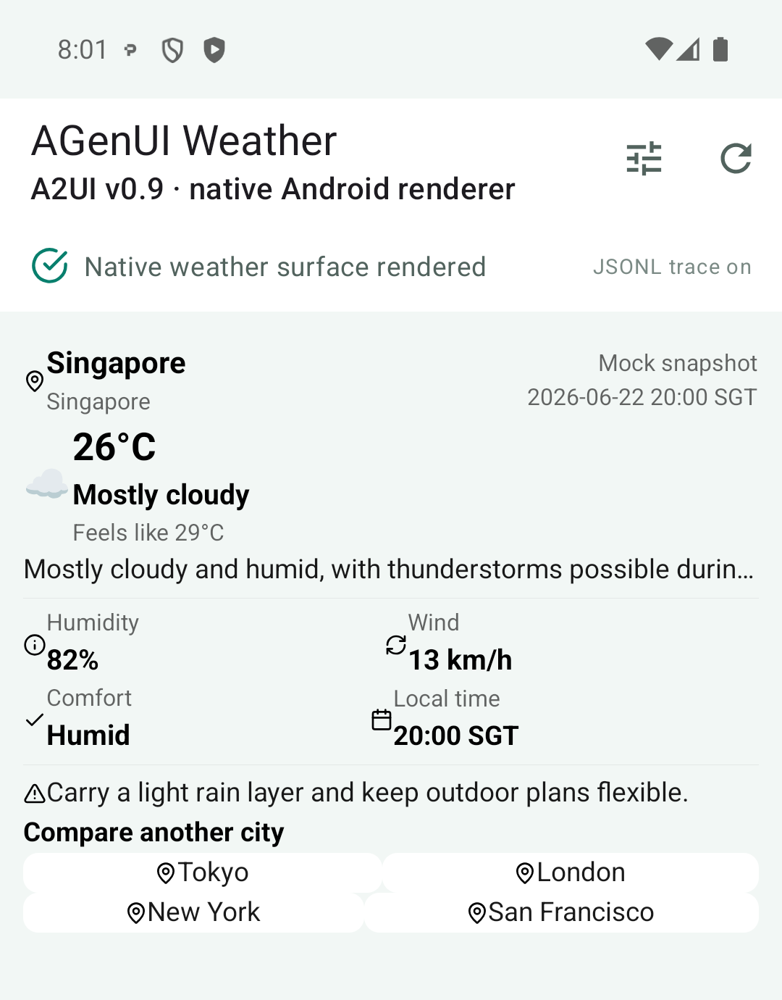
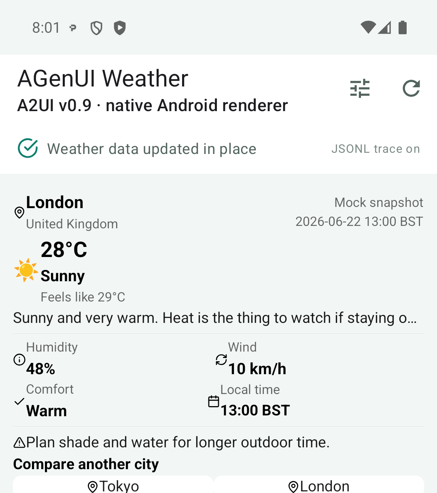

# AGenUI: A Native Android Implementation of A2UI

The weather experiment in Chapter 4 used the Flutter GenUI Renderer to consume A2UI messages. This chapter keeps the same Weather Server and A2UI output, replacing only the client with the AGenUI Android SDK to see whether the same UI description can be rendered directly into native Android Views.

The AGenUI project provides Renderers for Android, iOS, and HarmonyOS. This chapter discusses and verifies only its Android implementation. iOS and HarmonyOS appear briefly as parts of the project structure, without any experimental conclusions.

## What AGenUI Adds on Top of the A2UI Basic Catalog

The root Catalog in AGenUI 1.2.0 declares 25 components. Eighteen come from the A2UI Basic Catalog; the SDK adds `Table`, `Carousel`, `Web`, and `RichText`; `Chart`, `Markdown`, and `Lottie` are examples of custom components registered in the Playground. Components such as Lottie are therefore not bundled into the base SDK. An application can choose its own implementation and dependencies through the same registration mechanism.

Styling is another clear extension. AGenUI gives components a set of CSS-like Styles covering dimensions, margin, padding, gap, Flex, positioning, colors, corner radii, and shadows, along with Design Token and dark mode APIs. The following excerpt comes from the official Playground's `Card` configuration:

```json
{
  "id": "weather-card",
  "component": "Card",
  "child": "weather-body",
  "styles": {
    "padding": "24px",
    "border-radius": "16px",
    "background-color": "#FFFFFF"
  }
}
```

These layout fields are handled by Yoga in the shared C++ Core. Yoga is an open-source, cross-platform layout engine maintained by Meta. It implements layout rules close to Web Flexbox and is also used by React Native. AGenUI turns the same component tree into Yoga Nodes, calculates the position and size of each node, and then passes the results to the platform Renderers for Android, iOS, and HarmonyOS.

An output that stays within Basic Catalog fields can be reused across Renderers. Once it uses these Styles and extended components, the Agent output gradually depends on the AGenUI Catalog. In practice, the generation side gains finer visual control, while the client must understand the same styles and extended components to support that deeper customization.

AGenUI also takes streaming parsing one step further. Before the outer `updateComponents` object has fully closed, the Core can already extract any complete component objects inside it. Long strings in `Text`, `Markdown`, or the Data Model can also become internal incremental updates so that text appears earlier. The `textChunk` and `appendDataModel` messages here are internal to the AGenUI client; the server continues to send standard A2UI content.

## Rendering A2UI Messages as Android Views

AGenUI's main identity is an A2UI v0.9 Renderer SDK. A2UI defines the message contracts for `Surface`, Component, Data Model, and Action; AGenUI consumes those messages to create and update the client UI. The host App still decides whether those messages arrive over SSE, WebSocket, A2A, or an existing long-lived connection.

The Android SDK exposes a small streaming entry point to the host. Each chunk received by the network layer is passed into `SurfaceManager`:

```java
surfaceManager.beginTextStream();
for (String chunk : responseChunks) {
    surfaceManager.receiveTextChunk(chunk);
}
surfaceManager.endTextStream();
```

The shared C++ Core then handles protocol parsing, Data Model binding, component-tree maintenance, Yoga layout, and field-level diffing. JNI passes the result to the Android Renderer, which creates native Views such as `TextView` and `CardView`. Once a Surface has been created, the host only needs to add its root container to the current page:

```java
public void onCreateSurface(Surface surface) {
    container.addView(surface.getContainer());
}
```

Android still runs its own measure / layout process. AGenUI's `YogaAbsoluteLayout` positions native Views according to the Core's calculation, while the Android controls continue to handle interaction and drawing. The same Core is also reused by the iOS and HarmonyOS Renderers, which connect to UIKit and ArkUI respectively; a custom visual component still needs a platform implementation for each client.

## Replacing the Flutter Client

This experiment directly reused the Python A2A / A2UI Weather Server from Chapter 4. The mock weather data, A2UI v0.9 messages, and server-side Action handling stayed unchanged. The Android App added an Agent Card request, A2A SSE parsing, a Surface container, and Action forwarding. The verification environment used AGenUI 1.2.0, Android 15, and a Pixel 7 API 35 emulator.

The first request returned `createSurface`, `updateDataModel`, and `updateComponents`, from which the Android client created the weather card. No AGenUI-specific message conversion was involved: the JSON extracted from each A2A `DataPart` went directly into `SurfaceManager`.



*The same A2UI Weather output rendered as native Android Views through AGenUI. The screenshot uses the SDK's default theme, without registering an additional Theme.*

After the London button in the card was clicked, AGenUI produced a 174-byte Action Event and the host App sent it back to the same A2A Server. The server returned a 656-byte `updateDataModel` without sending `updateComponents` again. The AGenUI Core re-evaluated the data bindings and changed fields, and the existing Android Views updated to show the London weather.



*The London Action updates only the Data Model; the existing Surface and Android Views remain in use.*

The same server successfully drove both Flutter Widgets and Android Views. This result says more than several pages of logs: A2UI output within the Basic Catalog has a practical basis for reuse across Renderers.

## Once It Renders, Look at the Overall Result

One problem stood out the first time the Android page appeared: the card content was almost flush with its edges. The source explains why. AGenUI's default `Card` style declares only width, height, and a `16px` corner radius, without content padding. Android's `CardComponent` can map padding from Styles to `CardView.setContentPadding()`, yet the default value is 0, which is frankly baffling.

The default styling is sufficient for verifying the protocol and Renderer. A production product still needs to register its own Theme and Design Tokens, adding card insets, component spacing, typography, colors, dark mode, and accessibility rules. Letting the model decide every visual value on the fly is not a good bargain either. The application's base Theme is better suited to stable brand and platform conventions, while A2UI Styles can handle the parts that genuinely need to change dynamically.

The host App has more work to complete. A2A Tasks, conversation continuity, and reconnection belong to the surrounding Transport; the Catalog must be versioned alongside the client; high-capability components such as `Web` and `RichText` need domain, URL Scheme, HTML, and navigation policies. Adopting AGenUI also adds C++, NDK, and CMake tooling to an Android project, and all of that belongs in the maintenance cost.

## An Assessment

This experiment confirms that the same A2UI Weather Server can serve both Flutter and AGenUI Android clients. The most interesting parts of AGenUI are concentrated in its Renderer engineering: the shared C++ Core, native Android components, fine-grained streaming parsing, Data Model binding, and field-level diffing. It gives A2UI a directly runnable route into native Apps.

The product still has to maintain its Theme, Android host, Transport, and component extensions. As the output uses more AGenUI Styles, the interface becomes richer and its dependency on this particular Renderer grows. For a team that already owns a native Android component system and wants to connect it to an A2UI Agent, this is a fairly understandable trade-off.

## References

- [AGenUI README](https://github.com/AGenUI/AGenUI/blob/7112bfb8180fb4fd7e27ad6e8808c3da550a117d/README.md)
- [AGenUI Changelog](https://github.com/AGenUI/AGenUI/blob/7112bfb8180fb4fd7e27ad6e8808c3da550a117d/CHANGELOG.md)
- [AGenUI Catalog](https://github.com/AGenUI/AGenUI/blob/7112bfb8180fb4fd7e27ad6e8808c3da550a117d/agenui_catalog.json)
- [AGenUI API](https://github.com/AGenUI/AGenUI/blob/7112bfb8180fb4fd7e27ad6e8808c3da550a117d/docs/API.md)
- [A2UI Basic Catalog](https://a2ui.org/specification/v0_9/basic_catalog.json)
- [Yoga](https://www.yogalayout.dev/)
