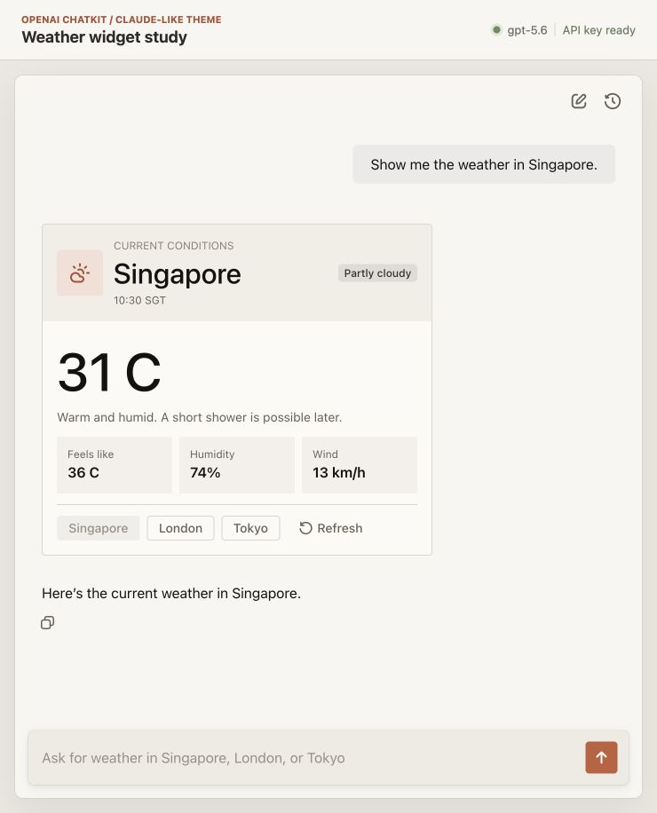
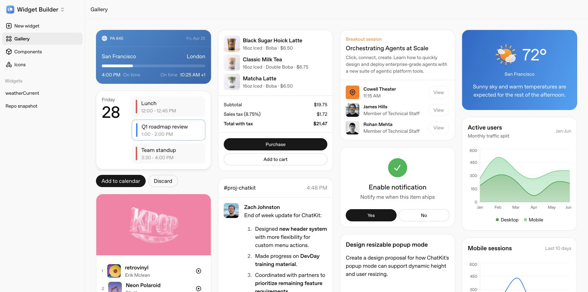
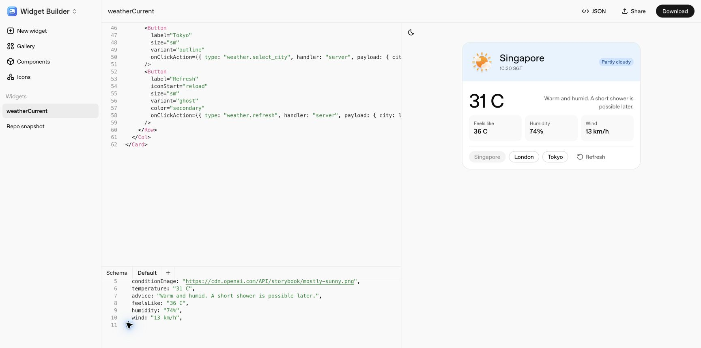
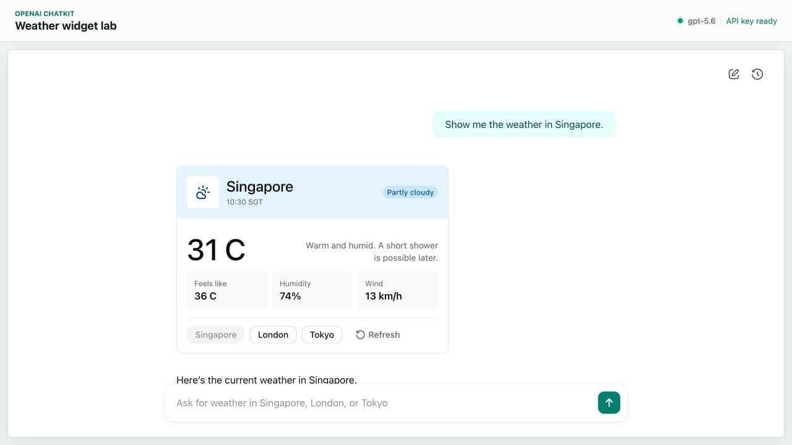

# OpenAI GenUI in Practice: ChatKit

When Chapter 5 introduced Vercel AI SDK, we described its approach as a basic mapping from a `Tool Call` to a predefined card component: the model first calls a Tool such as `getWeather`, then the frontend renders the Tool Result with an agreed component such as `<Weather>`. OpenAI's ChatKit **Widgets** largely follow the same approach. The main difference is at the UI layer: Vercel uses React components from the project directly, while ChatKit provides a fixed Widget Catalog.

We can therefore place ChatKit Widgets on the same `Tool Call` mapping path. ChatKit itself provides the complete outer shell of a chat product, including Threads, message streams, attachments, Actions, themes, and a composer. **Widgets within ChatKit** are the part discussed here: a GenUI approach based on predefined components.

As of August 2026, ChatKit officially recommends Custom Server Integration for new projects. The frontend embeds the ChatKit Web Component, while the backend uses a library such as the ChatKit Python SDK to connect a custom Agent. ChatKit previously supported direct integration with Hosted Workflows published through Agent Builder. Agent Builder is now in its migration period, and OpenAI plans to shut down the service on November 30, 2026. ChatKit itself will remain available.

## Who Builds a Widget?

As described above, ChatKit provides a complete page where chat history, the composer, and Widget cards all appear in the same interface. Let us first clarify who is responsible for each part of a weather Widget:

```text
ChatKit Widget Catalog + Developer Template + Runtime Data
                         ↓
                    Final Widget
```

| Part | Provided by OpenAI | Built by the developer |
| --- | --- | --- |
| Chat shell | Web Component, Thread, message stream, composer, and attachments | Embed the page, connect the `/chatkit` endpoint, and configure the theme |
| Widget | Catalog, default styles, and browser Renderer | Select components and arrange the card structure and copy |
| Template | `.widget` format, Studio, and Python `WidgetTemplate` | Write the template, Schema, Jinja data bindings, and conditions |
| Runtime data | Tool Call and Thread stream events | Implement the Tool and connect business data sources such as weather or orders |
| Interaction | Action events, loading states, and update APIs | Define Action names, parameters, and server-side handling logic |

The actual weather-card flow can also be reduced to five steps: the user asks about the weather, the model selects the `show_weather` Tool, the Tool returns weather data, the server calls `WidgetTemplate.build(data)`, and the ChatKit Renderer draws the final component tree. The model only needs to generate the Tool name and arguments. The developer's Template determines what the card looks like.

This chapter uses Custom Server Integration. `ChatKitServer.respond()` receives new messages, while `ChatKitServer.action()` handles clicks inside a Widget. Both entry points can write streaming events to the same Thread. This structure places ordinary replies, Tool Calls, Widgets, and follow-up actions in one conversation history.

## Global Theme and Individual Cards

Developers can customize the interface at two levels. The first is ChatKit's global Theme, which affects the chat shell and the base style of every Widget. This experiment configures a warm gray background, an orange accent color, corner radius, density, and font size in `useChatKit()`:

```ts
theme: {
  density: "spacious",
  colorScheme: "light",
  color: {
    accent: { primary: "#c15f3c", level: 1 },
    surface: { background: "#f7f6f2", foreground: "#eeeae3" }
  },
  radius: "soft",
  typography: { baseSize: 16 }
}
```

The second level is the `.widget` Template for an individual card. The weather card's background, border, padding, horizontal and vertical layout, icons, metric cells, and buttons are all defined in the Template. Styling is exposed through Catalog components and their Props, such as `Row`, `Col`, `Box`, `background`, `minWidth`, and `wrap`. These fields determine the layout and design Tokens used by the Renderer.

To test how far these two levels of customization can go, I built a Claude-like weather card using the same weather data and Actions. The global Theme handles the chat page, while the Template handles the inside of the card. ChatKit still provides the component rendering and interaction.



*The same ChatKit Components restyled with a global Theme and `.widget` Template to produce a Claude-like appearance.*

This result only takes inspiration from Claude's colors and spacing. Button states, responsive layout, and component implementation still come from ChatKit. Developers can adjust the fields exposed by the Catalog, but must also accept the Catalog's limits on component shapes and styling.

## Components and Widget Templates

The public components exposed by ChatKit Widgets fall into roughly four groups:

- Roots: `Card`, `ListView`, and `Basic`;
- Layout: `Row`, `Col`, `Box`, and `Spacer`;
- Content: `Text`, `Title`, `Icon`, `Image`, and `Chart`;
- Inputs and actions: `Button`, `Input`, `Select`, and `Form`.

The server ultimately sends the browser a JSON component tree. The weather card uses `Card` as its root, then organizes its content with `Row`, `Col`, and `Box`. The Vercel demo passes the Tool Result to a complete React `WeatherCard`; a ChatKit Template assembles these smaller components into a domain-specific card.

The outer structure of a `.widget` file contains `version`, `name`, `template`, and a `jsonSchema` for its input data. `template` is a Widget JSON string containing Jinja expressions, for example:

```jinja
{
  "type": "Icon",
  "name": {{ condition_icon | tojson }}
},
{
  "type": "Title",
  "value": {{ city | tojson }}
},

{
  "type": "Button",
  "label": {{ option | tojson }}
}

```

After the server calls `WidgetTemplate.build(data)`, Jinja fills in variables and evaluates conditions and loops, producing a `WidgetRoot`. This step does not require another model call. The Tool or application server prepares the data, and the Template assembles the component tree.

## Building Templates in Studio

ChatKit Studio provides a Gallery and Builder that help developers quickly understand and create `.widget` files visually. A project can start from natural language, a mockup, a blank file, or an existing `.widget`. Studio can display the component structure, Schema, sample data, live preview, and compiled JSON at the same time.



*The Gallery uses business examples such as flights, shopping, meetings, and weather to show how Catalog components can be combined.*

This experiment starts with `weather_current` from the Gallery, then changes San Francisco to Singapore. The weather card uses `flex={1}` to divide three metric cells evenly, with `minWidth` and `wrap` handling narrower containers.



*Edit the components, Schema, and sample data on the left, then inspect the rendered result on the right.*

In my experience, Studio speeds up `.widget` creation and previewing. It exports the file, which `WidgetTemplate` then reads in production. Developers can also modify the exported file further. The Claude-like version in this chapter follows that approach, changing the original blue theme to orange. An exported Action only describes the event name, arguments, and loading behavior. Business logic such as fetching weather or updating the Widget remains under the control of the application's frontend and backend. The Action recipient can be configured as either the frontend or the backend.

## The Open-Source Boundary: What Can Be Confirmed

- ChatKit's JavaScript repository publishes the component Props, Theme types, React Hook, and Web Component wrapper.
- The Python repository publishes `ChatKitServer`, Widget schemas, Templates, Thread events, Widget diffs, and the Action runtime.
- The browser Renderer is distributed through OpenAI's CDN, while Studio is available as an online tool.
- The public repositories currently cover the frontend and backend integration layers. The component Renderer and Studio are hosted by OpenAI.

This experiment also inspected the JavaScript and CSS downloaded by the browser. They contain the compiled component registry, default styles, and responsive rules. The weather card itself adapts to its container with `flex`, `minWidth`, and `wrap`, without declaring breakpoint expressions. Around it, the Renderer uses `ResizeObserver` to observe the Widget container and switches responsive rules at `280`, `355`, `435`, `555`, `755`, and `955` px. This provides concrete component definitions, styles, and width rules that can be checked. The evidence can only help explain how the page renders; no public information currently shows how OpenAI organizes the internal source code.

Because the intermediate implementation of the Renderer and Studio is not open source, this chapter does not list every internal object and event name or infer a complete flow from compiled output. Interested readers can try [ChatKit Studio](https://widgets.chatkit.studio/) and the [Widget Gallery](https://widgets.chatkit.studio/gallery) directly to experience the full process of composing, previewing, and exporting components.

## Weather Card Demo

This experiment uses `openai-chatkit` 1.6.5, `openai-agents` 0.22.0, `@openai/chatkit` 1.9.0, and `@openai/chatkit-react` 1.6.1. The frontend loads the ChatKit Web Component, local FastAPI runs `ChatKitServer`, and the Agents SDK calls the real `gpt-5.6`. The weather values come from a fixed fixture so that a third-party weather API does not affect observations of the Tool, Widget, and Actions.



*After the user sends a weather request, the model selects `show_weather`, and the server streams the weather Widget into the same Thread.*

After the user enters `Show me the weather in Singapore.`, the model's first structured output is short. After normalization by the Agents SDK, the experiment log looks like this:

```json
{
  "tool": "show_weather",
  "arguments": {
    "city": "Singapore"
  }
}
```

The `show_weather` Tool then reads the weather data from the fixture:

```json
{
  "city": "Singapore",
  "temperature": "31 C",
  "condition": "Partly cloudy",
  "condition_icon": "lucide:cloud-sun",
  "humidity": "74%",
  "wind": "13 km/h",
  "feels_like": "36 C",
  "observed_at": "10:30 SGT"
}
```

The Tool passes this data to the `.widget` template while also returning the result to the model. The template generates a `Card` component tree and writes it to the Thread. After receiving the Tool Result, the model generates one more sentence: `Here’s the current weather in Singapore.` This turn therefore produces two OpenAI Responses: the first selects the Tool, and the second adds natural-language text.

The interval from the start of the model request to the `show_weather` Tool Call was 2,169 ms. The complete Widget arrived at 2,874 ms, and the full Response finished in 4,429 ms. This latency includes a real model request and an intentionally added local loading state of about 700 ms. The data itself does not use a remote weather service.

## How a Widget Streams into View

The `show_weather` Tool returns an asynchronous process. It first yields a loading Widget, waits briefly, then yields the complete result:

```python
async def states():
    yield build_loading_weather_widget(city)

    await asyncio.sleep(0.7)
    snapshot = get_weather(city)
    yield build_weather_widget(snapshot)

await ctx.context.stream_widget(states())
```

The ChatKit Python SDK converts the two `WidgetRoot` states into events such as `thread.item.added`, `thread.item.updated`, and `thread.item.done`. The frontend product code does not need to define a separate weather-card SSE protocol. It only needs the ChatKit Web Component to consume the Thread stream.

The experiment also exposed a very specific issue: when `Icon.name` was set to `cloud-sun`, the page displayed no icon. The official ChatKit JS API Reference defines `LucideIcon` as ``lucide:${string}``, while `ChatKitIcon` includes both ChatKit's built-in names and `LucideIcon`. We can therefore conclude that `cloud-sun` and `lucide:cloud-sun` are looked up in two different icon tables.

After `WidgetTemplate.build()` processes a `.widget`, it converts the result into a `DynamicWidgetRoot`. This type allows the template to carry additional fields, and the build process does not use the `.widget` file's `jsonSchema` to validate every icon name. As a result, `cloud-sun` reaches the browser without an error. The Renderer then routes the name: an unprefixed name goes to ChatKit's built-in icon table, while a name with the `lucide:` prefix goes to the Lucide icon table. ChatKit's built-in table does not contain `cloud-sun`, so the first render produces a blank area. After the name is changed to `lucide:cloud-sun`, the Renderer finds the corresponding Lucide chunk and displays the icon correctly.

This issue shows that the `.widget` Schema, Python template build, and browser Renderer are three separate checks. Passing the first two only means that the JSON structure can continue through the pipeline. Enum values inside a component must still be recognized by the Renderer. It is a small trap worth knowing about.

## How Buttons Continue the Interaction

The weather Widget has four buttons at the bottom: Singapore, London, Tokyo, and Refresh. Each button carries an `ActionConfig`:

```json
{
  "type": "Button",
  "label": "London",
  "onClickAction": {
    "type": "weather.select_city",
    "handler": "server",
    "payload": {
      "city": "London"
    }
  }
}
```

After a click, ChatKit sends the Action to `ChatKitServer.action()`. In this experiment, the server reads the London fixture directly, replaces the card with a loading Widget, then replaces it with the London card about 450 ms later. Tokyo and Refresh follow the same flow. All three Actions set `invokes_model` to `false`, so the number of model runs stays unchanged before and after each Action.

The server also writes a `HiddenContextItem` to the Thread to record that the user selected London. When the user sends the next message, the model can read this action from the conversation history. `action()` could instead call the model or write a new message. This experiment updates the UI locally and adds hidden context.

## Platform and Language Boundaries

On the backend, Widgets are ordinary JSON, so any backend language or framework can generate the same component tree. The official `.widget + Jinja + WidgetTemplate` toolchain currently lives in the Python SDK. The public Node.js packages do not yet appear to provide an equivalent template compiler or Custom Server runtime. A Node.js project will generally need to construct Widget JSON with TypeScript functions or integrate its own template engine. The ChatKit Renderer ultimately reads the component tree received by the browser.

On the client, ChatKit is a Web Component. Other platforms can therefore embed Web content and could theoretically implement their own Renderer for the Widget Catalog. OpenAI does not currently provide a native Renderer comparable to A2UI Flutter or AGenUI Android, so ChatKit client deployments remain strongly Web-oriented.

## An Assessment

In my view, the greatest reference value of ChatKit Widgets comes from the large amount of real-world usage data that ChatGPT has accumulated over time. It is reasonable to infer that OpenAI can use earlier usage scenarios to understand what a chat window needs to show and which actions users often take, then organize those findings into a reasonably practical component library. When an open GenUI framework builds its own Catalog, ChatKit's component definitions are useful product references. At minimum, a team does not need to begin its experiments with only `Text + Button`.

At the same time, the ChatKit Renderer and Studio are hosted and distributed by OpenAI, while the official Custom Server toolchain currently favors Python. This creates several concrete upgrade risks. For example, the official page currently loads `chatkit.js` without a version number and offers neither a way to pin the Renderer version nor an option to self-host it. If component parameters, responsive breakpoints, or default styles change, teams must revalidate both deployed Widgets and historical Widgets when users reopen them. Long-term dependence on ChatKit for core business flows therefore increases maintenance and rollback costs.

On the other hand, this hosted approach removes the early work of implementing components, a chat shell, and a Thread runtime. It is well suited to quickly testing whether users want an Agent Chat product and how much value GenUI adds to it.

## Other GenUI-Related Technologies in the OpenAI Ecosystem

### MCP Apps

MCP originally connected models to external data and tools. MCP Apps adds UI Resources and an iframe communication protocol to that path. An MCP Tool uses `_meta.ui.resourceUri` to point to an HTML App written in advance by the developer. In ChatGPT, OpenAI's Host loads it in a sandbox iframe, then passes in the Tool Input, Tool Result, theme, dimensions, and other information through the MCP Apps Bridge.

The model only needs to select the Tool and fill in its arguments. The page layout and interaction code are already written in the HTML App. MCP Apps is therefore closer to "Tool + Web View": it provides a standard mounting mechanism for third-party interactive interfaces in ChatGPT, but does not itself define a UI language that lets the model compose components.

### Structured Outputs

Structured Outputs can support another experiment that is closer to A2UI. A developer first describes predefined components such as `Card`, `Text`, and `Button` in a recursive JSON Schema, then asks the model to generate a component tree that follows that Schema. The client maps node names to components on React or another platform. OpenAI's official GitHub sample also streams Function Arguments and uses `partial-json` to parse unfinished JSON, allowing completed portions to appear gradually. In this approach, developers must implement the component library, styles, Renderer, state, and Actions themselves. Structured Outputs mainly constrains the structure generated by the model. It provides a starting point for building a custom GenUI system, but considerable engineering work remains before it reaches frameworks such as A2UI and OpenUI, which already include protocols and runtimes.

## References

- [ChatKit @ OpenAI](https://developers.openai.com/api/docs/guides/chatkit)
- [Advanced integrations with ChatKit @ OpenAI](https://developers.openai.com/api/docs/guides/custom-chatkit)
- [ChatKit widgets @ OpenAI](https://developers.openai.com/api/docs/guides/chatkit-widgets)
- [Actions in ChatKit @ OpenAI](https://developers.openai.com/api/docs/guides/chatkit-actions)
- [ChatKit Widget Gallery](https://widgets.chatkit.studio/gallery)
- [ChatKit Python SDK @ GitHub](https://github.com/openai/chatkit-python)
- [ChatKit JS SDK @ GitHub](https://github.com/openai/chatkit-js)
- [LucideIcon @ OpenAI ChatKit JS](https://openai.github.io/chatkit-js/api/openai/chatkit/type-aliases/lucideicon/)
- [OpenAI ChatKit Advanced Samples @ GitHub](https://github.com/openai/openai-chatkit-advanced-samples)
- [Agent Builder @ OpenAI](https://developers.openai.com/api/docs/guides/agent-builder)
- [Add UI to your MCP server @ OpenAI](https://developers.openai.com/plugins/build/chatgpt-ui)
- [Structured Outputs @ OpenAI](https://developers.openai.com/api/docs/guides/structured-outputs)
- [OpenAI Structured Outputs Samples @ GitHub](https://github.com/openai/openai-structured-outputs-samples)
