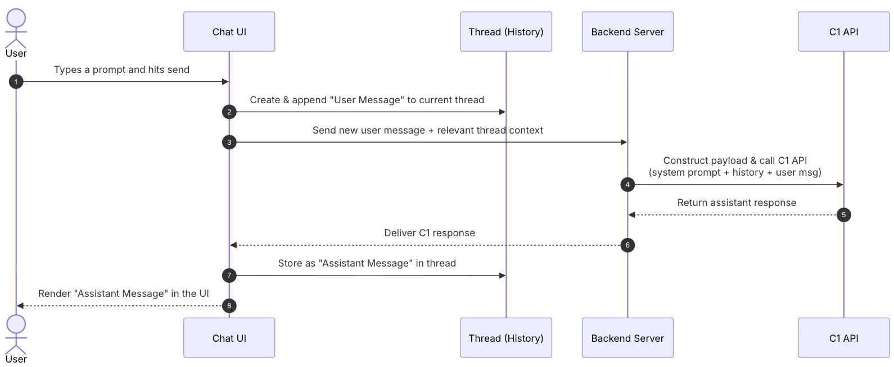
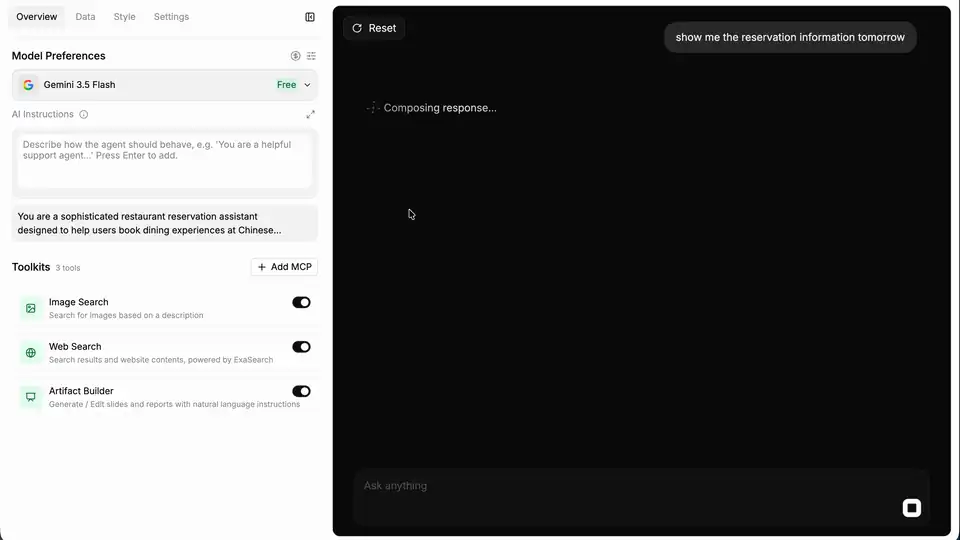
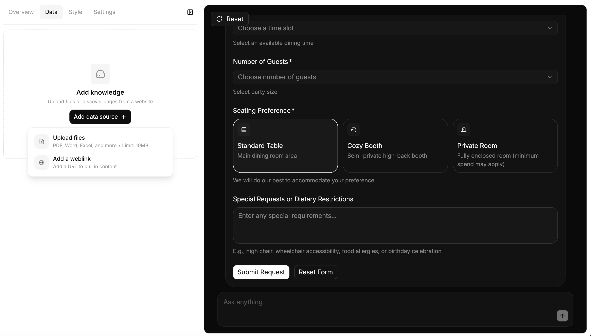
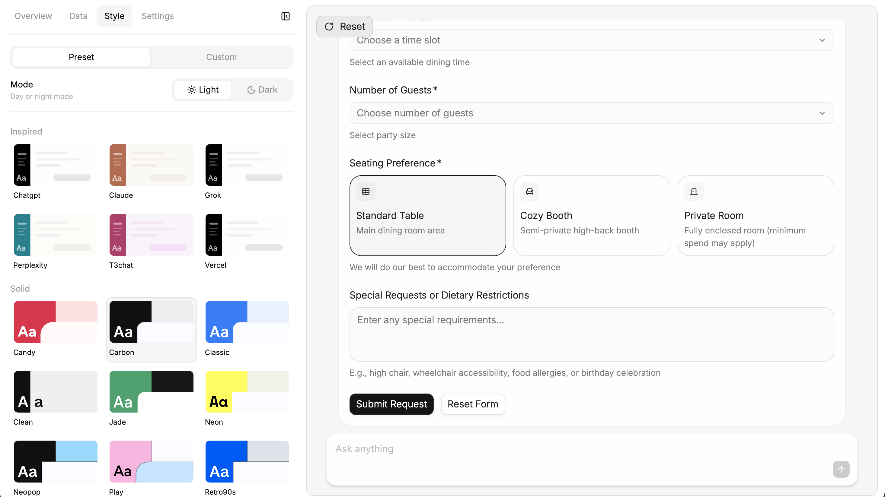
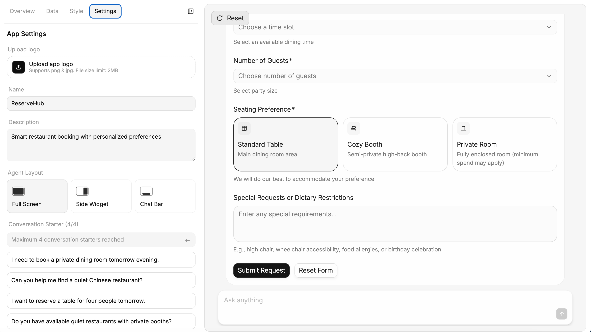
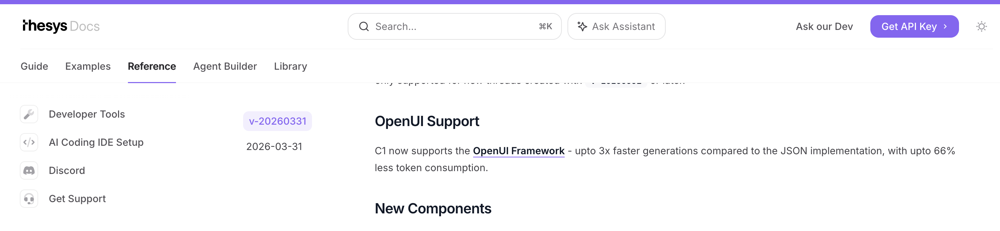
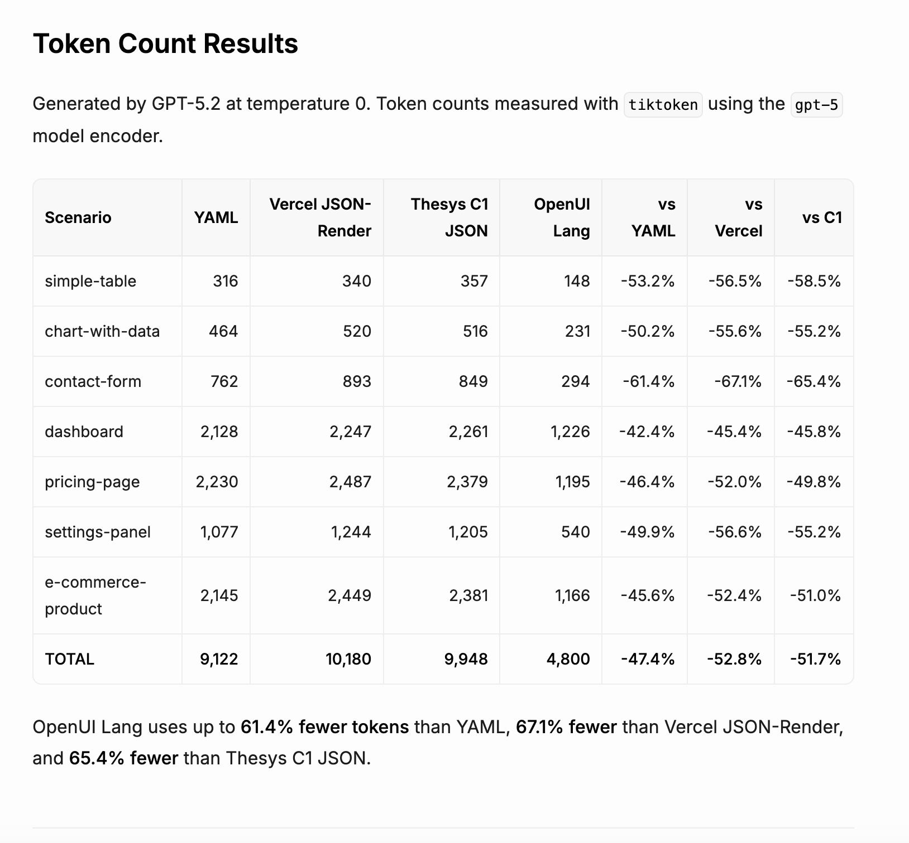
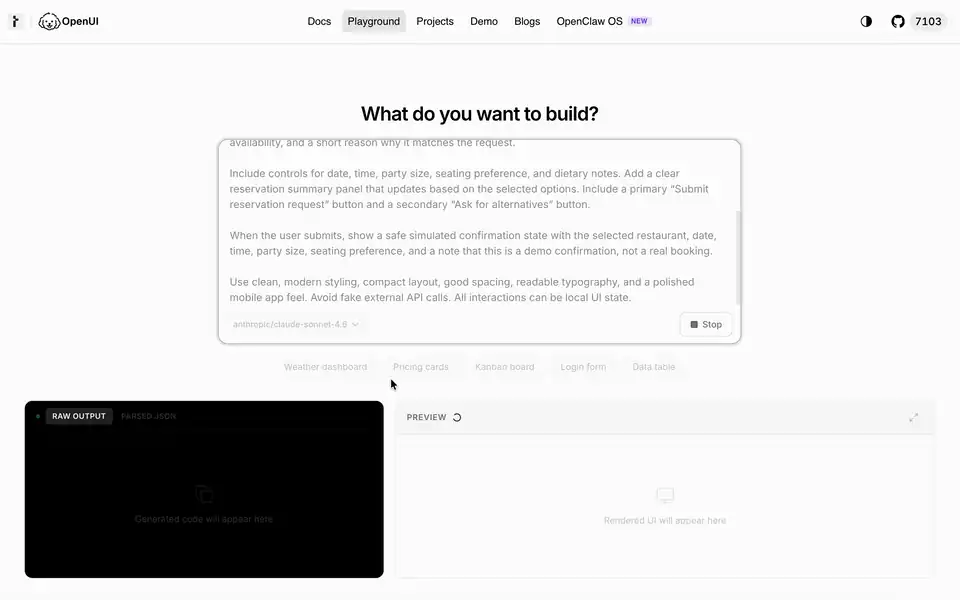

# OpenUI 与 Thesys C1

Thesys 是家位于 SF 的创业公司，官网自己写的定位是  [The Generative UI Company](https://www.thesys.dev/)。主要围绕 UI 生成、报表、Agent Builder 和 OpenUI Cloud 做文章。它蛮值得放在这里观察，是因为它同时给出了商业化产品和底层 UI 开源框架两条线索。

## 目前的商业化产品 C1

C1 是 Thesys 商业化产品线里的 GenUI API&Components。按官方文档的流程图，后端用 OpenAI-compatible API 格式调 C1 的服务，拿到一段 C1 Response，再交给前端的 `<C1Component>` 或 `<C1Chat>` 渲染成可交互 UI。



不难理解，它们走的是类似中介转发的模式。从[商业模式设计](https://www.thesys.dev/pricing)上也印证了这点，一个独立的 C1 用量套餐加明牌的“御三家”模型作为实际执行的 LLM，模型价格特别强调了 "no markups"（对比 LLM Provider 无额外涨价）， 而 LLM Provider 确定的有 OpenRouter。

下图黑色区域的 `thesys-agent` 是 Thesys Console 里创建的 demo widget，可被嵌入到其他客户的页面里，是一个主推的产品形态（即 chat-like products）。



从 Console 侧看，C1 不只是一个模型 API，它还带了一层面向业务方配置 agent 的产品界面。这个界面里可以配置数据源、视觉 preset、应用名称、描述、布局和 conversation starters，然后在右侧实时预览生成出来的交互界面。








## OpenUI 的出现

从公开发布时间看，OpenUI 是 Thesys 后来开源出来的表达层和 runtime。官方文档把它拆成 Library、Prompt Generator、Parser、Renderer 几块：应用先定义组件库，生成 system prompt，模型输出 OpenUI Lang，再由 parser 和 renderer 渲染成 React UI。OpenUI 和 C1 有明显的上下游关系：





通过两张官网的截图不难理解，C1 早期使用 JSON 作为输出格式，而后期随着 OpenUI Lang 的出现，提高了 Token 的吐出效率，C1 就切换到了 OpenUI Lang 上面去。

## Prompt 到 OpenUI Lang



上方动图对应的是一个模拟订餐 demo。原始业务 prompt 很短，主要给了几个约束：`mobile-first restaurant reservation interface`、`quiet Chinese restaurant for 4 people tomorrow evening`、提交后展示 `safe simulated confirmation state`。这些信息只够描述场景；要让模型输出 renderer 能吃的 UI，还需要 OpenUI 在 system prompt 里补一份更硬的输出合约。

我在本地 demo 里看到的这份 prompt，大致可以拆成三层：

- **OpenUI 的基础输出规则**：先把模型的输出通道收窄到 `openui-lang`。入口必须叫 `root`，每一行按 `identifier = Expression` 写，最后不能包 Markdown、JSON、HTML 或代码围栏。  
  例子：`Your ENTIRE response must be valid openui-lang code`；`root is the entry point`。
- **组件库展开出来的完整 schema**：这是占篇幅最多的一层。它把 runtime 认识的组件、参数顺序、字段类型、action 表达式、`$binding`、表单校验等都塞给模型。`CardHeader`、`TextContent`、`Carousel`、`Form`、`Button`、`FollowUpBlock` 这些组件能不能被正确调用，基本就看这一层有没有讲清楚。  
  例子：`Button(label, action?, variant?)`；`Carousel([[title, image, description, tags], ...])`。
- **Demo 自己补的任务约束**：最后才是订餐场景本身。这里会要求优先使用 OpenUI 内置 chat 组件，提交后只做模拟确认，不能声称已经完成真实预订。当然，真实情况下的 agent 设定肯定是不同的，例如某些按钮可以通过 `Action([@ToAssistant(...)])` 把点击转换成下一轮对话，这个机制适合“换几个选项”“继续解释”“帮我比较一下”这类低风险动作；`Submit reservation request` 就不只走继续对话，UI runtime 读出表单值，触发明确的业务 action 或 mutation，后端处理库存、权限，再把结果状态交还给前端。模型可以参与生成下一屏文案和解释，预订是否成功要以业务系统的返回结果为准。 
  例子：`quiet Chinese restaurant for 4 people tomorrow evening`；`do not claim a real booking was made`。

三层主内容过后，生成的 prompt 里还加了 few-shot examples。基本上就是用几段小型 OpenUI Lang 程序示范“表格 + follow-up”“可点击列表”“图片轮播”“表单校验”告诉 LLM 应该怎么组织一个界面。最后，再给出一段完整输出大概长什么样：先写 `root`，再把标题、列表、表单、按钮和数据逐个补齐。

可以看到，最终的 Raw output 长得像一张定义表。截取开头十来行如下：

```txt
root = Stack([header, filterCard, restaurantSection, summaryCard, actionButtons, confirmModal])

header = Card([headerContent], "clear", "column", "none", "start", "start")
headerContent = Stack([headerTitle, headerSub], "row", "s", "center")
headerTitle = TextContent("🍜 Reserve a Table", "large-heavy")
headerSub = TextContent("AI-powered dining assistant", "small")

filterCard = Card([filterHeader, filterFields], "sunk", "column", "s")
filterHeader = TextContent("Your Preferences", "small-heavy")
filterFields = Stack([dateRow, timePartyRow, seatingField, dietaryField], "column", "s")
dateRow = FormControl("Date", DatePicker("date", "single", {required: true}, $date))
```

它先把顶层结构和几个引用名列出来，后面再依次补 `header`、`filterCard` 这些具体定义。这个顺序对 OpenUI 很重要：parser 可以先接受 unresolved reference，等后续 chunk 到了再补解析结果。换句话说，OpenUI Lang 的表达方式是为一边生成一边渲染（Streaming rendering）设计的，它不必等一整棵 JSON 树都完整闭合之后才开始工作（当然，这边还有其他解法）。


## 参考资料

- [Thesys Introduces C1 to Launch the Era of Generative UI @ Thesys](https://www.businesswire.com/news/home/20250418761213/en/Thesys-Introduces-C1-to-Launch-the-Era-of-Generative-UI)：C1 在 2025-04-18 的公开发布稿。
- [Conversational UI Concepts @ Thesys](https://docs.thesys.dev/guides/conversational/concepts#the-flow-of-a-conversation)：Thesys 官方文档里的 conversation flow 示意图。
- [Thesys @ Product Hunt](https://www.producthunt.com/products/thesys)：C1 在 2025-09-30 的 Product Hunt 发布记录，以及 OpenUI 在 2026-03-11 的 Product Hunt 发布记录。
- [Why We're Open Sourcing OpenUI @ Rabi](https://www.thesys.dev/blogs/openui)：Thesys 在 2026-03-11 发布的 OpenUI 开源说明。
- [OpenUI GitHub Repo @ thesysdev](https://github.com/thesysdev/openui)：OpenUI 的开源仓库；repo 创建时间早于公开发布，可作为代码历史参考。
