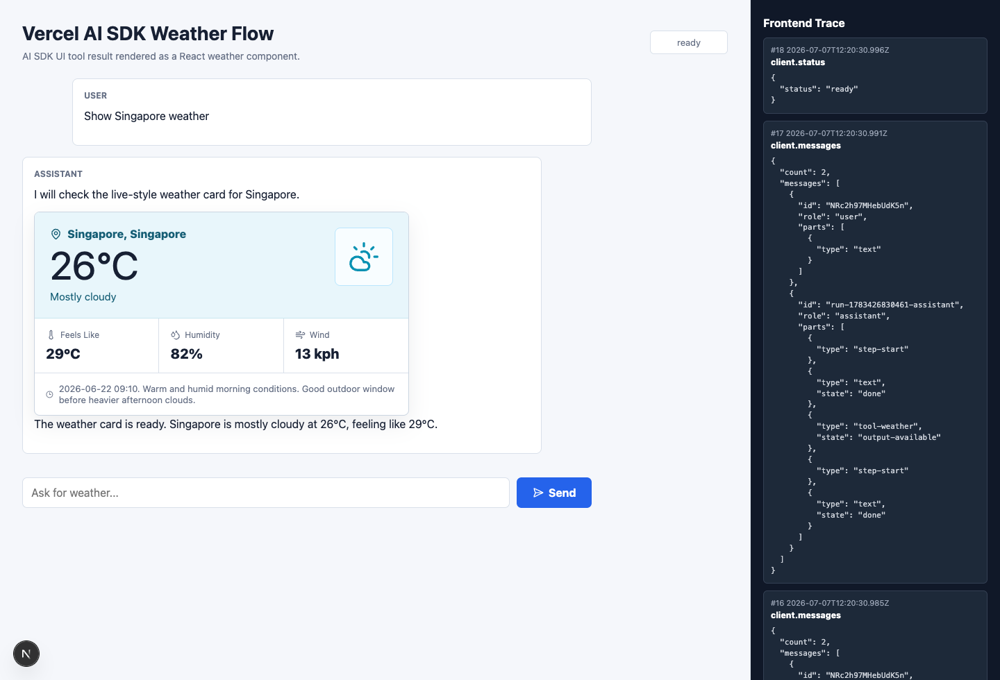

# Vercel AI SDK 的 GenUI 功能

看完 OpenUI 和 A2UI，再看 Vercel AI SDK UI，会有一种明显的落差。基本上 Vercel 当前的 [Generative UI](https://ai-sdk.dev/docs/ai-sdk-ui/generative-user-interfaces) 功能，只是把一次 tool call 的结果直接映射给**一个 React component** 渲染。

以本章的查天气 Demo 为例，在 Vercel 的这个流程里，模型没有获得任何组件 catalog，也不需要决定一张卡片里放几个 `Row`、`Text` 或 `Button`。它纯粹从 tools 里选出 `weather`，生成查询参数，前端看到返回 stream 里的 `tool-weather` part 后，再显示一张已经写好的天气卡片。

本章把这种典型结构概括为：

```text
Tool -> Semantic Component 的映射式 GenUI
```

`Semantic Component` 不是 AI SDK 里的正式类型，它只是本章为了比较而使用的称呼，指天气卡片、股票卡片、订单卡片这类带有完整业务语义的组件。它们的布局、样式和内部交互都已经写在应用里，粒度远大于 `Card`、`Icon`、`Text` 这些元组件。

AI SDK 没有强制 tool 和组件一一对应；一个 tool 也可以只显示文字，多个 tool 也可以共用 renderer。不过官方教程和 Vercel 自己的 Chatbot 都采用了很直接的写法：每种 `tool-${toolName}` part，在前端分支里映射到一张对应的 Semantic Component。因此，在本章讨论的范围内，可以粗略把它看成一条近似一一对应的路线。

## Tool 到 Semantic Component

下面我们拆分成模型侧和应用侧各自分析。首先模型侧会拿到 prompt、conversation history 和 tool contract。以本地天气 demo 为例，发给 model adapter 的主要内容如下：

```text
system: You are a concise weather assistant.
        Use the weather tool when the user asks for weather.

user:   Show Singapore weather

tool:   weather
        description: Display a rich weather card for a city.
        input: { city: string /* City name to look up. */ }
```

`input` 来自 tool 的 Zod `inputSchema`，AI SDK 会把它转换成 JSON Schema 后交给 model provider。模型可以据此输出：

```text
weather({ city: "Singapore" })
```

到这里，模型的 UI 决策已经结束。`rich weather card` 只是 tool description 里的能力说明，没有告诉模型图标放哪、温度用多大字号，也没有把 `WeatherCard.tsx` 发给模型。

应用侧则是另一段普通 React 代码：

```tsx
if (part.type === 'tool-weather') {
  return (
    <WeatherCard
      input={part.input}
      output={part.output}
    />
  );
}
```

`WeatherCard` 里**固定使用了天气、位置、温度、湿度和风速图标，也固定了顶部 hero、三列指标和底部摘要的布局**。换句话说 AI SDK 负责把 `weather` tool 的输入、输出和执行状态送到浏览器；而卡片样式，是应用代码固定的。

当然，应用方如果自己定义一个 `renderUI` tool，并在 input schema 里塞进完整组件树，理论上也可以继续向元组件拼接的路线扩展；那套 catalog、schema、parser 和 renderer 需要应用自己实现，等于是自己再造了一个 A2UI/OpenUI。

## 核心交互结构

虽然 UI 表达很简单，tool call 从模型走到 React 的过程并不是直接传一个 JSON 就结束。AI SDK 在模型消息、前端消息和流式传输之间加了一层比较完整的状态转换：

```text
Browser input
  -> UIMessage
  -> ModelMessage + Tools
  -> streamText / ToolLoopAgent
  -> tool call
  -> tool execute
  -> tool result
  -> UIMessageChunk
  -> SSE
  -> useChat
  -> typed tool part
  -> Semantic Component

tool result
  -> 下一轮 ModelMessage
  -> 模型继续解释或调用其他 tool
```

我们像读 A2UI 一样先认识几个核心对象，降低理解成本：

- `Tool`：暴露给模型的一项语义能力，主要由 name、description、input schema 和可选的 `execute()` 组成。它描述“可以做什么”，不会描述 React 组件的内部布局。
- `ModelMessage`：真正进入模型上下文的消息，包括 system instructions、用户输入、assistant tool call 和 tool result。
- `UIMessage`：前端使用的对话状态。除了文本，它还可以容纳 reasoning、tool parts、custom data 和 metadata。
- `UIMessageChunk`：服务端增量发给浏览器的传输单元，例如 `text-delta`、`reasoning-delta`、`tool-input-available`、`tool-output-available` 和自定义 data part。
- `typed tool part`：`useChat` 合并 chunks 后得到的前端对象。静态 tool 会形成 `tool-${toolName}` 类型，例如 `tool-weather`。
- `useChat`：消费 UI message stream，把零散 chunks 合并回 `messages`，再触发界面重新渲染。配合 transport 和服务端 resume 机制，还可以继续一条中断的 stream。

typed tool part 还有一组直接给 UI 使用的状态：

```text
input-streaming
input-available
output-available
output-error
approval-requested
```

前端可以在参数还没完整生成时展示 skeleton，在 tool 执行中显示 loading，拿到 output 后切换成结果卡片，失败或需要用户批准时显示另外的状态。此外还有 `approval-responded`、`output-denied` 等状态，下文的批准流程会用到。它没有 A2UI 的 `Surface`、`Catalog`、`Data Model` 和 `Action`，但它把 chat-like UI 最常见的 tool execution lifecycle 整理成了可消费的前端状态。

## 天气卡片 Demo

为了看清这些中间产物，我做了一个本地天气 demo。实验使用 `ai@7.0.16` 和 `@ai-sdk/react@4.0.17`，模型部分换成 deterministic mock streaming model，确保每次都能复现相同的 tool call 和日志。



用户输入 `Show Singapore weather` 后，浏览器先通过 `useChat` 和 `DefaultChatTransport` 发送一条 `UIMessage`。服务端把它转换成 `ModelMessage`，连同 `weather` tool 一起交给 `ToolLoopAgent`。

本地 mock model 的第一轮 stream 会输出一句文本和一次 tool call：

```json
{
  "type": "tool-call",
  "toolName": "weather",
  "input": {
    "city": "Singapore"
  }
}
```

这里需要说明实验边界：mock model 直接写死了 `weather` 和 `Singapore`，没有真的阅读 prompt 后再选择 tool。这次实验检查的是 tool call 如何进入 UI stream，不用于判断某个真实模型能否稳定选对 tool。

`weather.execute()` 是一个 async generator。它先 yield loading，再返回完整天气数据：

```ts
async *execute({ city }) {
  yield {
    state: 'loading',
    city,
    message: `Fetching ${city} weather...`,
  };

  yield {
    state: 'ready',
    city: 'Singapore',
    temperatureC: 26,
    feelsLikeC: 29,
    humidity: 82,
    windKph: 13,
  };
}
```

AI SDK 把这些 model/tool stream parts 转换成 UI message chunks。截取几条关键输出，可以看到 tool input、临时 loading 和最终结果沿着同一条 SSE 依次到达：

```jsonl
{"type":"tool-input-available","toolName":"weather","input":{"city":"Singapore"}}
{"type":"tool-output-available","output":{"state":"loading","city":"Singapore"},"preliminary":true}
{"type":"tool-output-available","output":{"state":"ready","city":"Singapore","temperatureC":26}}
```

`useChat` 不需要理解天气业务。它只负责把这些 chunks 合并成一个 `tool-weather` part，并随着 `input-available`、`output-available` 等状态变化触发 React 重新渲染。页面代码识别到 `tool-weather`，再把 input 和 output 交给 `WeatherCard`。

tool result 还会被放回下一轮 `ModelMessage`。模型因此知道新加坡是 26°C，可以继续输出一句总结，也可以根据结果调用下一个 tool。一份结果在这里有两个消费者：React 用它画卡片，模型用它继续当前 agent loop。

Vercel 官方的[天气示例](https://ai-sdk.dev/docs/ai-sdk-ui/generative-user-interfaces)也是同样的组织方式：定义 `displayWeather` tool，返回 location、weather 和 temperature，前端遇到 `tool-displayWeather` 后手动渲染 `<Weather {...part.output} />`。Vercel 开源的 [Chatbot](https://github.com/vercel/chatbot) 也把 `getWeather` output 映射到预先写好的 `<Weather />` 组件。换掉数据字段和组件样式，流程基本没有变化。

## 组件里的按钮如何继续

从界面效果看，官方示例里常见的是 confirmation 和 approval 两类交互，不过它们在 SDK 里的层级不同。approval 是 tool lifecycle 的内置状态：服务端 tool 请求批准后，前端会收到 `approval-requested`，按钮通过 `addToolApprovalResponse()` 回传允许或拒绝。允许后继续执行原来的 tool，拒绝则得到 `output-denied`。

confirmation 并不是另一种内置 action。官方的 `askForConfirmation` 只是一个没有 `execute()` 的自定义 client-side tool：模型先调用它，应用预先写好的 React 组件展示确认按钮，用户点击后再用 `addToolOutput()` 把选择写回这次 tool call。

```text
askForConfirmation -> input-available -> 用户点击按钮
  -> addToolOutput() -> output-available -> 下一轮模型调用

server tool -> approval-requested -> 用户允许或拒绝
  -> addToolApprovalResponse() -> 执行原 tool / output-denied
```

其他自定义按钮行为也需要预先写进对应的 Semantic Component。按钮可以修改本地状态、调用业务 API、用 `sendMessage()` 发起一轮新对话，或者通过上面的 API 补齐当前 tool call。应用还要配置自动提交条件，或手动调用 `sendMessage()`，才能让模型继续处理。下一轮拿到 tool result 或 approval result 后，模型再决定是否调用另一个 tool；新的 typed tool part 仍由前端映射到事先写好的组件。

## 简单带来的工程价值

从 UI 表达层看，这条路线能研究的内容不多。模型生成的是 tool call，元组件结构、数据绑定和局部 UI 更新都没有形成独立协议。不过它把 agent 和前端之间一批琐碎的连接工作收进了统一的 message stream。

text、reasoning、tool input、tool output、custom data 和 metadata 可以沿着同一条 stream 到达浏览器。`useChat` 负责增量合并 message parts，并让 React 根据最新状态重新渲染；配合持久化、transport 和 resume 接口，应用也不用为每一种内容重新设计一套流式协议。

接入成本同样很低。一个已经存在的 Web 产品，只要增加 tool 和预定义的组件，再把 output 传给现有组件，就能把 agent 执行结果以一个预定义的 UI 组件形式展示到对话里。

## 参考资料

- [Generative User Interfaces @ AI SDK UI](https://ai-sdk.dev/docs/ai-sdk-ui/generative-user-interfaces)
- [createAgentUIStream @ AI SDK Core](https://ai-sdk.dev/docs/reference/ai-sdk-core/create-agent-ui-stream)
- [Stream Protocols @ AI SDK UI](https://ai-sdk.dev/docs/ai-sdk-ui/stream-protocol)
- [Vercel AI SDK @ GitHub](https://github.com/vercel/ai)
- [Vercel Chatbot @ GitHub](https://github.com/vercel/chatbot)
