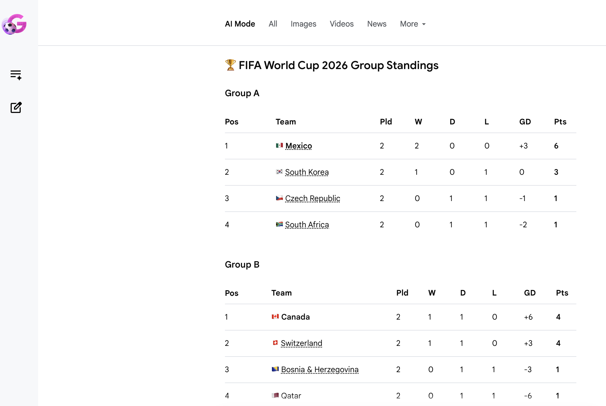
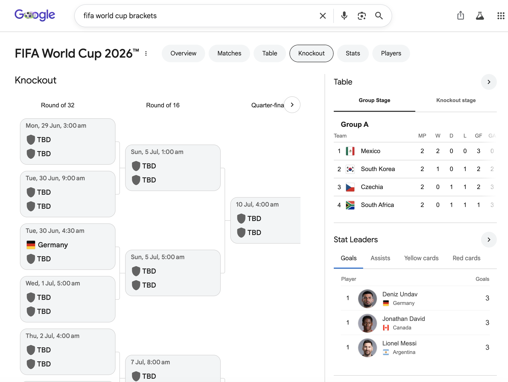

# Chat-like GenUI 與其他形態

本章延續我先前的中文部落格 [《A2UI、AG-UI，以及聊天框之外的 GenUI》](https://2bab.me/zh/blog/2026-05-15-a2ui-agui-surface-spec/) 裡的幾項觀察，後半段再加入 Google Research 的 [Generative UI 案例](https://research.google/blog/generative-ui-a-rich-custom-visual-interactive-user-experience-for-any-prompt/)。

GenUI 領域目前許多討論的焦點會先落在 chat-like GenUI。這裡的 chat-like 可以先理解成一種產品邊界：使用者在一次對話裡提出需求，系統回傳一段範圍有限的 UI，使用者再透過按鈕、表單、follow-up action 或繼續提問往下走。部落格文章裡我記錄過這個現象：

> 目前 A2UI 和 AG-UI 的重心仍然很明顯地落在 **chat-like style** 上

現在回頭看，這裡面的商業訴求很明顯，也與當下世界的注意力重疊。但本章更關心另一個角度，也是技術田野調查該看的面向：Chat-like GenUI 可以把生成式 UI 的複雜度收在一次對話、一張卡片、一個 panel 或一段 response 裡，是一個很好的起點。

## 一次對話裡的複雜度

一個 chat-like GenUI response 通常不需要生成完整 App，更常見的形態是推薦清單、比較表格、資訊卡片、確認按鈕、圖表。對不少 AI Native 產品來說，這個範圍很舒服：UI 的生命週期短，狀態不會跨頁面保留，使用者很快就能接受，例如把它理解為一種 Markdown 的複雜延伸。（註：這雖然是個技術比喻，但一般使用者其實不在意這裡用了什麼技術，對他們來說就是一種更順手的豐富延伸）

這會直接影響工程實作：元件可以預先定義，版面可以限制在少數幾種組合裡，action 也可以先從低風險動作開始，例如「換幾個選項」「展開更多資訊」「把這個選擇傳回 assistant」。當單次 response 的複雜度不高時，上層為特定產業預先定義的元件及其限制，已經足以組出可用體驗。

C1、OpenUI、A2UI、AG-UI 這些專案的方向可能不同，但許多 demo 都在做類似的事：先提供 component catalog、schema、action 類型和 style preset，再讓模型在這個集合裡組裝。模型負責「在邊界內組合」，產品介面的主要結構仍掌握在宿主應用程式手中。

## Schema 和 Runtime

A2UI / AG-UI 這組例子很適合在這裡作為輕量參照。我先前把它們的關係概括成：

> A2UI 比較像 payload/schema，AG-UI 比較像 runtime pipe。

這個區分有助於理解 chat-like GenUI 為什麼容易成為早期切入點。A2UI 關心 agent 要呈現什麼 UI：使用哪些元件、綁定哪些資料、開放哪些動作。AG-UI 關心 agent 和前端如何持續通訊：文字如何串流輸出，工具呼叫如何進入 UI，使用者確認如何回到 agent，狀態更新如何傳給前端。

放在 chat-like 情境裡，這兩層都比較容易收斂。payload 不需要涵蓋完整產品的資訊架構，runtime 也主要圍繞一次任務展開。它們要處理的狀態、元件和 action 數量有限，測試和復原也更容易做。

## 聊天框之外

聊天框只是一個入口。那篇文章裡我還寫過另一個判斷：

> ...新聞 App 仍然需要閱讀頁，Podcast App 仍然需要單集介紹頁，雜誌仍然需要專題...

這類情境更接近 general GenUI 的形態。問題從「一輪對話裡生成一段結果」，擴展成「讓原有產品裡的內容表面（content surface）理解自己承載的內容、狀態和使用者意圖」，接著再動態組織版面、推薦、評論、分享、廣告、延伸閱讀與行動入口。

Google Research 在 2025-11-18 發布的 [Generative UI 文章](https://research.google/blog/generative-ui-a-rich-custom-visual-interactive-user-experience-for-any-prompt/) 裡，把這個形態推得更遠。原文提到，這套實作會動態建立 visual experiences 和 interactive interfaces，例子包括 `web pages, games, tools, and applications`，並根據任意 question、instruction 或 prompt 自動設計和客製化。按照原文的說法，它目前落在兩個入口：Gemini app 裡一項名為 **dynamic view** 的實驗功能，以及 Google Search 的 AI Mode。在 dynamic view 裡，Gemini 會為每個 prompt 設計並撰寫 `a fully customized interactive response`；實作部分則寫明使用 Gemini 3 Pro，再加上 tool access、system instructions 和 post-processing。因此，這裡先把它理解為前文討論的、更自由的 GenUI 方向。

*圖片來源：Google Research 文章中的範例影片。*

這個方向更接近「自由」的 GenUI，但從外界可見的產品形態來看，它還沒有成為一個經過大規模測試的通用入口。至少在我目前能開啟的 Google Search + AI Mode 裡，還沒有體驗到文章範例中那種為一次問答生成完整客製介面的能力。能穩定看到的仍是 Google 搜尋頁裡較傳統的動態元件：例如查詢世界盃時會出現賽程、積分榜、淘汰賽、球員資料等模組。

以下兩張螢幕截圖可以說明這個差異。同樣圍繞世界盃資訊，AI Mode 比較像把結果呈現為一張 Markdown 表格；Google Search 的一般結果頁則已經有明確的垂直領域 UI，包括 tab、淘汰賽樹狀圖、積分榜和球員資料。

這條路線值得一看。它可以先用傳統 BDUI 的方式運作，例如後端根據 query 辨識世界盃、天氣、股票、航班、食譜等垂直領域，再傳送一組受控元件。加上傳統 ML / 搜尋與推薦系統，決定哪些模組出現、如何排序、哪些資料比較可靠。這裡的 UI 已經是動態的，只是動態性主要來自嚴格的結構化資料、領域範本和搜尋與推薦系統。

LLM 介入後，這條路線可以逐步增加自由度，General GenUI 實際導入的難度也會明顯上升。頁面生命週期更長，狀態可能跨頁面儲存，設計系統要持續約束模型輸出，測試也不再只看某一次 response 是否合理。產品團隊還要回答一個更麻煩的問題：哪些部分可以生成，哪些部分必須維持穩定，哪些動作需要明確的權限與復原機制。

因此，chat-like GenUI 比較像一個合適的觀察入口。它把生成式 UI 的問題收在可控範圍內：有限元件、有限狀態、有限 action、有限生命週期。等這些機制能在一次對話裡穩定運作，再擴展到完整頁面、原生 App 和更 general 的內容表面，或許到了這時，問題才會真正成為 UI expression layer 和 UI runtime 的長期設計。

## 平台和技術選項

最後談談平台技術與選擇。現在許多 AI Native 產品明顯更偏 Web Frontend，一個重要原因是 Web 在「動態性」與「合規要求」方面的限制比較少；GenUI 在多平台考量上則會遇到一些阻力，主要是 Android 和 iOS 原生 App 都不能任意動態傳送可執行程式碼。若要在手機上做 GenUI，通常只能採用受控元件/BDUI，或是 RN 這類更接近 Web runtime 的方案。因此，多數方案先在 Web 試行，也呼應文首的思路：它們都是從更局部的情境開始，找到合適的實作方式，chat-like 就是一種。過去也有不少電商 App 首頁長期使用 RN 或其他動態化框架來處理活動版位和瀑布流裡的 Cell，這些經驗未來在 GenUI 裡可能也有獨特的做法。

## 參考資料

- [Generative UI: A rich, custom visual interactive user experience for any prompt @ Yaniv Leviathan, Dani Valevski, Vishnu Natchu, Yossi Matias](https://research.google/blog/generative-ui-a-rich-custom-visual-interactive-user-experience-for-any-prompt/)
- [A2UI、AG-UI，以及聊天框之外的 GenUI @ 2BAB](https://2bab.me/zh/blog/2026-05-15-a2ui-agui-surface-spec/)
