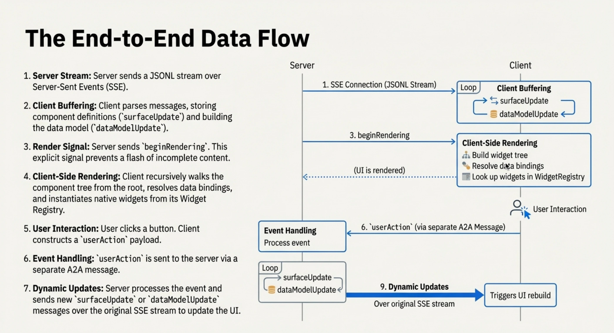

# Google A2UI 及其生態系

本章只討論 A2UI 這套以協定為基礎的表示方式，不展開 Google Research 曾在 AI Mode 展示的 Dynamic View。A2UI 官方給自己的定義很直接：

> A2UI (Agent to UI) is a declarative UI protocol for agent-driven interfaces.

官方說明進一步指出，A2UI 讓 agent 產生 JSON messages，再由用戶端使用自己的 native components，將內容呈現在 Web、mobile、desktop 等平台上，同時避免執行任意程式碼。這個定義有三個關鍵字：`declarative`、`messages`、`native components`，也就是它的主要路線，是把「想呈現什麼」的 Intent 整理成結構化資料，再交給宿主應用程式裡的 renderer；模型臨時撰寫前端頁面程式碼，或把一段 iframe 塞進宿主應用程式，都屬於它比較過的替代路線，並非 A2UI 要做的事。

## 核心概念／核心物件

閱讀 A2UI 的官方說明時，先掌握這幾個核心概念會輕鬆許多：

- `Surface`：一塊可以由 agent 建立、更新或刪除的 UI 區域。
- `Catalog`：用戶端宣告自己支援哪些元件，以及這些元件有哪些參數。
- `Component`：具體的 UI 元素，例如 `Text`、`Button`、`Card`、`TextField`。
- `Data Model`：用戶端儲存的一份狀態樹，元件可以透過 path 綁定其中的資料。
- `Action`：使用者點擊、送出、選擇之後，回傳給 agent 或伺服器的行為入口。

A2UI 把這些物件拆開後，生成式 UI 更像一組依序抵達的更新：先建立 surface，再補上元件結構，再填入資料，後續的使用者操作也會回到同一個流程裡，而不只是一段會被呈現的文字。



*A2UI 端到端資料流示意：伺服器以串流傳送、用戶端呈現、使用者動作回傳，再進入下一輪更新。圖中沿用了早期協定命名。*

## 產生時輸出什麼

依照目前規格中的 v0.9 / v0.9.1 形態，A2UI 從伺服器到用戶端的輸出主要圍繞四類訊息：`createSurface`、`updateComponents`、`updateDataModel` 和 `deleteSurface`。官方網站目前把 v0.9.1 標為 Current，v1.0 仍放在 Candidate 下；以下 demo 使用的是 Flutter GenUI 目前支援的 A2UI v0.9 路徑。

官方 Data Flow 頁面把 A2UI 輸出描述成一串 JSON 訊息；在**串流情境**裡，這些訊息通常可以**透過 JSONL，以一行一個物件的方式傳輸**。如果把這些訊息包成一般的 JSON array，等完整 UI 產生完再一次回傳，A2A 的非串流呼叫或一般 HTTP JSON 在複雜情境裡就很容易變成漫長等待，甚至遇到閘道或平台逾時。因此，A2UI 很適合透過 A2A streaming、SSE 或 WebSocket 這類通道逐則推送訊息，讓用戶端先建立 surface，再補上資料和元件。

一個最小化的形式大致如下：

```jsonl
{"version":"v0.9","createSurface":{"surfaceId":"weather","catalogId":"https://a2ui.org/specification/v0_9/basic_catalog.json"}}
{"version":"v0.9","updateDataModel":{"surfaceId":"weather","path":"/","value":{"city":"Singapore","temperature_c":26}}}
{"version":"v0.9","updateComponents":{"surfaceId":"weather","components":[{"id":"root","component":"Column","children":["title"]},{"id":"title","component":"Text","text":{"path":"/city"}}]}}
```

這裡和 OpenUI 的差異很明顯。OpenUI 的輸出更像：

```txt
root = Stack([header, filterCard, restaurantSection])
header = Card([headerTitle], "clear")
headerTitle = TextContent("Reserve a Table", "large-heavy")
```

A2UI 則選擇了更明確的 JSON envelope。元件結構是一組 flat component list，每個元件都有自己的 `id`，父元件透過 child id 參照子元件。這種設計讓單一元件的更新或加入一組資料，都能成為局部訊息，省下重新傳送整棵深層巢狀樹的成本。

這一節也為後面的第 6 章做了鋪陳：如果只問「模型產生了什麼」，OpenUI 和 A2UI 已經給出兩種很不同的答案。OpenUI 更像 DSL 程式；A2UI 則更像傳統 BDUI 訊息格式加上串流化的新外殼。

## 跨平台是 A2UI 的特色

A2UI 的官方說明把 portability 放在很前面的位置：同一份 agent response 可以在 Web、mobile、desktop 上，由不同 renderer 映射成各平台的原生 UI。Flutter GenUI 的 README 也寫道：

> The Flutter Gen UI SDK uses the A2UI protocol

Android 和 iOS 原生 App 通常不適合從遠端動態傳送可執行程式碼（尤其是原生程式碼），可行的路徑通常是 JavaScript 執行環境，或內嵌自行實作的直譯器（如 Lua），這對 OpenUI 是不小的限制。因此，A2UI 伺服器或 agent 只傳送宣告式資料，renderer 在本機把這些資料映射成 Flutter widget、SwiftUI view 或 Jetpack Compose composable。

它為行動 App 指出一條相當清楚的工程路徑：UI 可以動態組合，但程式碼和元件實作仍然屬於用戶端。相比之下，OpenUI / Thesys C1 目前更自然地落在 Web / React 這條路線上；要讓同一套 OpenUI Lang 自然映射到 Kotlin / Swift 原生元件，除了直譯器層的實作複雜度，還得處理更多語意和 platform runtime 的銜接問題。

當然，A2UI 也不會憑空解決跨平台一致性的問題。catalog 一旦變得複雜，不同平台 renderer 的元件行為、版面安排細節、無障礙、主題和錯誤復原都要分別測試。

## 周邊生態系

A2UI 本身只是 UI payload / schema / renderer contract，真正整合進產品時，還需要周邊生態系配合。

一個常見的搭配是 AG-UI。AG-UI 更像 runtime/event pipe，負責 agent execution、文字串流、tool call、state、user input 等事件。此外，名為 CopilotKit 的函式庫能把 AG-UI 和 A2UI 串接到 React / Next 這類前端應用程式裡。從這個拆分來看會更清楚：A2UI 負責「要顯示什麼 UI」，AG-UI 負責「agent 和 UI 如何持續通訊」，CopilotKit、Flutter GenUI 這類專案則負責把它整合進具體的應用程式框架。

## Flutter 天氣卡片 demo

為了看看 A2UI 在行動裝置上的實際樣貌，我之前做了一個本機 Flutter 天氣 demo。這個 demo 的伺服器同樣回傳結構化資料，不會臨時產生 Flutter 程式碼；Flutter App 透過 `genui` / `genui_a2a` 連線到一個 Python A2A server，伺服器根據 mock weather 資料回傳文字和 A2UI data parts，Flutter 端再用 `SurfaceController` 呈現為原生 widget。


這個 demo 的流程可以濃縮成幾個步驟：

```text
Flutter App
  -> A2uiAgentConnector
  -> Python A2A weather server
  -> mock weather lookup
  -> text + A2UI data parts
  -> SurfaceController
  -> Flutter widget tree
```

用戶端發出請求時，會把 A2UI capability 放進 A2A message metadata 裡，告訴伺服器自己支援 v0.9 basic catalog：

```json
{
  "metadata": {
    "a2uiClientCapabilities": {
      "v0.9": {
        "supportedCatalogIds": [
          "https://a2ui.org/specification/v0_9/basic_catalog.json"
        ]
      }
    }
  }
}
```

這裡的 `catalogId` 可以先理解成這塊 surface 使用的「元件字典」。用戶端透過 `supportedCatalogIds` 宣告自己認得這套 basic catalog，伺服器在 `createSurface.catalogId` 裡選用同一個 ID；後續 `updateComponents` 裡的 `Column`、`Card`、`Button`、`Icon` 等元件名稱和屬性，都依這套 catalog 解讀。這套機制讓兩端對齊同一組可呈現的元件和參數約定，程式碼則由用戶端既有實作提供，無須動態下載。

伺服器最終回傳 4 個 part。第一個是一般文字，後面三個是 A2UI data part。這裡先省略 A2A 外層的 task / status 欄位，只看 final message 裡的 `parts`：

```json
{
  "parts": [
    {
      "kind": "text",
      "text": "Singapore: Mostly cloudy, 26°C (feels like 29°C)."
    },
    {
      "kind": "data",
      "data": {
        "version": "v0.9",
        "createSurface": {
          "surfaceId": "weather",
          "catalogId": "https://a2ui.org/specification/v0_9/basic_catalog.json",
          "sendDataModel": true
        }
      }
    },
    {
      "kind": "data",
      "data": {
        "version": "v0.9",
        "updateDataModel": {
          "surfaceId": "weather",
          "path": "/",
          "value": {
            "city": "Singapore",
            "country": "Singapore",
            "temperature_c": 26,
            "condition": "Mostly cloudy",
            "humidity": 82,
            "wind_kph": 13,
            "feels_like_c": 29
          }
        }
      }
    },
    {
      "kind": "data",
      "data": {
        "version": "v0.9",
        "updateComponents": {
          "surfaceId": "weather",
          "components": [
            {
              "id": "root",
              "component": "Column",
              "align": "stretch",
              "children": ["heroCard", "cityCard"]
            },
            {
              "id": "heroCard",
              "component": "Card",
              "child": "heroBody"
            },
            {
              "id": "temperatureText",
              "component": "Text",
              "variant": "h1",
              "text": "26°C"
            },
            {
              "id": "londonButton",
              "component": "Button",
              "variant": "borderless",
              "child": "londonButtonChild",
              "action": {
                "event": {
                  "name": "select_city",
                  "context": {
                    "city": "London"
                  }
                }
              }
            }
          ]
        }
      }
    }
  ]
}
```

最後這個 `updateComponents` 才是 UI 結構的主要部分。為了控制篇幅，上面的 JSON 只保留幾個重要元件；本機 demo 的實際訊息裡有 66 個元件，組成天氣主卡、城市資訊、溫度、濕度、風速、舒適度、提醒文字和城市切換按鈕。Flutter 端收到 `CreateSurface`、`UpdateDataModel`、`UpdateComponents` 後，會把訊息交給 `SurfaceController`，再由 renderer 從 `root` 開始建構 widget tree。

按鈕也走同一套流程。使用者點擊 London 後，Flutter 會傳送一個 A2UI action data part，裡面帶有 action 名稱、來源元件和城市參數：

```json
{
  "version": "v0.9",
  "action": {
    "name": "select_city",
    "sourceComponentId": "londonButton",
    "context": {
      "city": "London"
    },
    "surfaceId": "weather"
  }
}
```

伺服器辨識出 `select_city`，查出 London 的 mock weather，再回傳新一輪的三則 A2UI 訊息：`createSurface`、完整的 `updateDataModel`，以及包含全部 66 個元件的 `updateComponents`。Flutter 端重新呈現後，主卡會變成 London，`londonButton.variant` 也會變成 `primary`。一次完整的互動往返，呈現出它如何持續接收使用者操作、更新資料、替換元件。


## 參考資料

- [What is A2UI? @ A2UI](https://a2ui.org/introduction/what-is-a2ui/)
- [Data Flow @ A2UI](https://a2ui.org/concepts/data-flow/)
- [Components & Structure @ A2UI](https://a2ui.org/concepts/components/)
- [Transports @ A2UI](https://a2ui.org/concepts/transports/)
- [Flutter GenUI @ GitHub](https://github.com/flutter/genui)
- [A2UI @ GitHub](https://github.com/google/A2UI)
