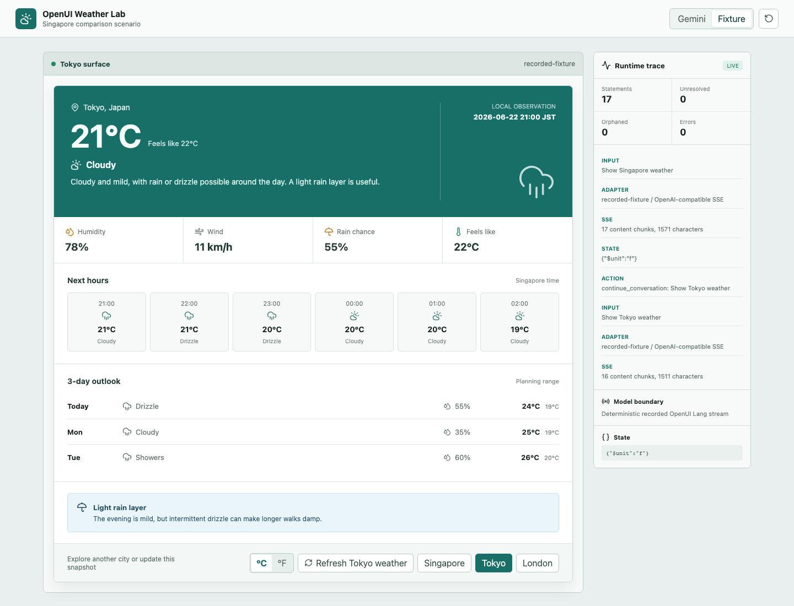
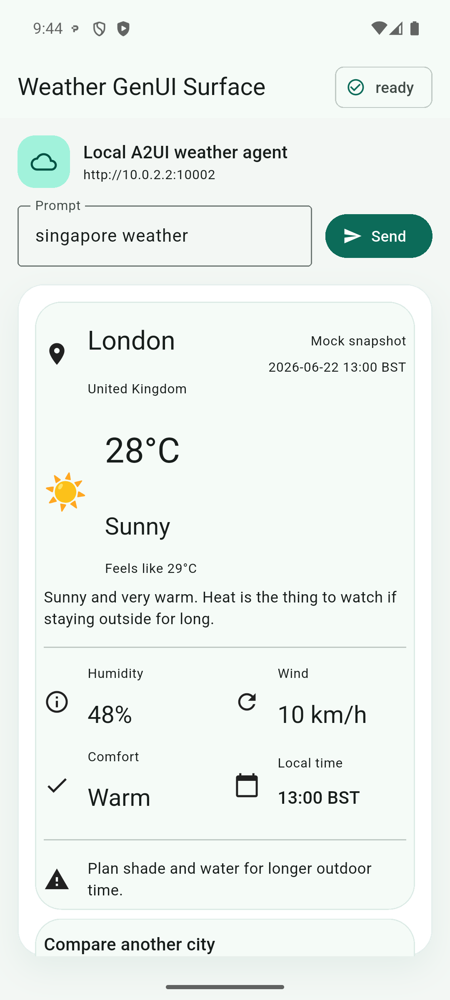
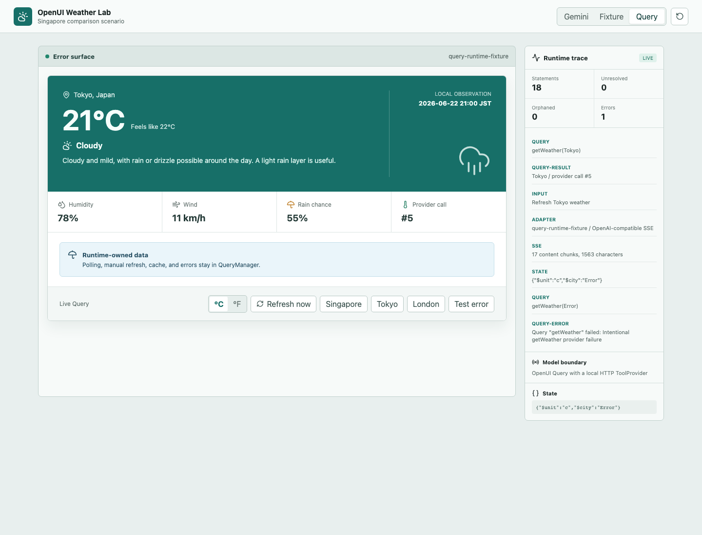

# UI 生成後，不同框架的資料和行為如何繼續流轉

UI 由 renderer 繪製出來，代表生成和渲染已經接通。使用者接下來會切換 Tab、選擇城市、填寫表單、送出訂單，伺服器端的資料也可能自行變動，需要通知用戶端。一個 GenUI framework 能否進入真實產品，更多時候取決於這些動作如何延續。接續上一章，本章繼續比較 OpenUI 和 A2UI 在這些情境下的操作，並沿用上一章的天氣 demo。

我們先看幾次實際點擊，再把問題分成三類：本機狀態、業務動作和外部資料更新。

## 問題：一次點擊應該走到哪裡

OpenUI 天氣卡片裡有兩類按鈕。`°C / °F` 只修改本機 `$unit`，不會發出網路請求；點選 Tokyo 則透過 `@ToAssistant("Show Tokyo weather")` 回到 host，重新請求一份 OpenUI Lang：



A2UI 天氣卡片裡的 London 按鈕會送出一個帶有 `surfaceId`、`sourceComponentId` 和 city context 的 action。Python 伺服器查詢新的 mock weather，再回傳一輪 A2UI messages，Flutter Surface 最後變成 London：



表面上都是「點按鈕，換城市」，實際路徑差異很大：

|動作|OpenUI weather demo|A2UI Flutter weather demo|
|:---|:---|:---|
|切換 °C / °F|`$unit` + state field，由 runtime 在本機完成|本次 demo 尚未實作本機單位切換|
|選擇城市|`@ToAssistant` 發起新一輪 UI response|A2UI action 經 A2A 送回伺服器|
|回傳結果|重新生成完整 OpenUI program|只傳送 `updateDataModel(path=/weather)`，更新 13 個 bindings|
|本次 renderer|React state/runtime|Flutter `SurfaceController`|


## 本機狀態：OpenUI Store 和 A2UI Data Model

OpenUI 可以在 program 中宣告變數：

```text
$unit = "c"
hero = WeatherHero(..., $unit)
units = UnitToggle("Temperature unit", $unit)
```

點選 `UnitToggle` 後，它會透過 state field 寫入 OpenUI runtime store。`WeatherHero`、`HourlyForecast` 和 `DailyForecast` 訂閱同一個 `$unit`，所以 26°C 可以直接變成 79°F。整個過程留在瀏覽器，不需要 assistant 或天氣 provider 參與；host 還可以透過 `onStateUpdate` 觀察並持久化這份狀態。OpenUI Lang 另外提供 `@Set` / `@Reset`，讓生成的 Action 修改同一類 runtime state。

實驗也呈現了 state lifetime 的細節。使用者先切換到 °F，再點選 Tokyo。新的 OpenUI response 又宣告了 `$unit = "c"`，畫面切回 Celsius；右側 host trace 儲存的最後一份 state snapshot 仍是 `{"$unit":"f"}`。換句話說，program declaration 和 host persistence 是兩層狀態，應用程式需要決定新 response 到來時要採用 reset、merge 還是 hydrate。

A2UI 把狀態集中在 Surface 的 Data Model。元件屬性可以綁定 path：

```json
{
  "id": "temperatureText",
  "component": "Text",
  "text": { "path": "/weather/temperatureLabel" }
}
```

後續 `updateDataModel` 修改 `/weather/temperatureLabel`，訂閱該 path 的 native component 就能重新建構。TextField、selection、validation 等互動也能圍繞 Data Model 組織，用戶端還可以註冊函式來處理格式化或衍生值。

後面的天氣實驗會重用這棵 component tree，只透過 Data Model 寫入 London snapshot，再觀察 payload、rebuild 和 UI state。

## 業務動作：模型不必參與每一次點擊

OpenUI 的 `@ToAssistant` 適合「換個城市」、「繼續解釋」、「給我另一組方案」等對話動作。它把一段 human-friendly message 交給 host，再由應用程式決定如何開始下一輪 assistant response。

真實的 `Submit reservation request` 需要另一條路徑。OpenUI 的 `Mutation()` 可以註冊 host 提供的 tool，按鈕透過 `@Run(mutationRef)` 執行；應用程式也可以在 `onAction` 中接管自訂行為。表單值、使用者身分、庫存和權限交給業務 API，等 API 回傳成功或失敗後再更新 UI。模型可以參與生成說明，訂單是否成立仍由業務系統決定。

A2UI action 本身是一個 domain event。本次 London action 的主要內容如下：

```json
{
  "action": {
    "name": "select_city",
    "surfaceId": "weather",
    "sourceComponentId": "londonButton",
    "context": { "city": "London" }
  }
}
```

伺服器端可以直接處理 `select_city`，也可以把它交給 agent。A2UI 關心 action 來自哪個 Surface、哪個 component、帶了什麼 context；授權、冪等、業務驗證和最終結果仍屬於產品後端。按鈕是否進入 LLM，則由外圍 Agent runtime 和業務流程決定。

因此，一條可控的 action flow 通常要分成三種：

1. UI state，例如 tab、展開與收合、暫時的 selection，留在 local runtime。
2. Deterministic business action，例如重新整理、下單、核准，呼叫明確的 tool/API。
3. Intent continuation，例如更換方案、解釋結果、重新組織介面，再回到模型或 agent。

把所有按鈕都送回 assistant，會讓回應變慢，業務邊界也更模糊；把所有狀態都寫在元件內部，下一輪 UI 又很難還原。框架提供的是表達能力，應用程式仍需為每個 action 選擇正確的執行層。

## 外部資料：訂單狀態自行改變時怎麼辦

天氣和訂單都有一種常見情況：使用者沒有點選任何項目，資料已經在伺服器端改變。這個問題可以更清楚地呈現 OpenUI 和 A2UI 的 runtime 取向。

OpenUI 的 `Query()` 由 host `toolProvider` 執行。它可以在 streaming 結束後自動查詢，也可以帶有 refresh interval：

```text
order = Query("getOrder", {id: $orderId}, {status: "loading"}, 30)
refresh = Button("Refresh", Action([@Run(order)]))
```

假設 `statusText` 綁定到 `order.status`，runtime 每 30 秒重新呼叫 `getOrder` 後就能更新元件，不必重新生成版面。輪詢適合更新頻率低、即時性要求有限的情境；更高頻的資料通常需要 push 或更明確的失效策略。

`@Run(order)` 可以主動執行 invalidation/refetch；query args 中引用的 state 改變時也會重新查詢。這套能力很方便，但產品需要補上 query policy。例如，搜尋框若把每次輸入都直接綁定到 query args，使用者每輸入一個字元就可能送出一次請求；debounce、cancellation、cache、retry 和權限仍由 runtime/tool provider 這一側設計。OpenUI 把 query 放進 UI program，業務系統繼續決定這些請求策略。

A2UI 的處理方式更接近伺服器端狀態同步。初次 response 建立 Surface 和 data bindings，訂單狀態改變後，伺服器端可以再送出：

```json
{
  "version": "v0.9",
  "updateDataModel": {
    "surfaceId": "order-detail",
    "path": "/status",
    "value": "shipped"
  }
}
```

這則訊息可以來自一條持續的 SSE/WebSocket/A2A stream，也可以由 App 自行輪詢後送進 `SurfaceController`。A2UI 定義的是 Surface update message；資料從哪裡來、transport 是否為長連線、斷線後如何還原，仍需由外圍 runtime 和產品架構補齊。

如果 component tree 已經綁定 `/status`，這次只需推送資料；訂單增加一塊退款表單，或物流節點清單的結構改變時，再傳送 `updateComponents`。這正是 Data Model 與 component definitions 分離後可以取得的更新粒度。

## 重用版面，只更新資料

把這個問題帶回天氣 Demo：UI 已經完成生成和渲染，後續取得新資料時繼續使用現有版面。OpenUI 保留同一個 Renderer 和 Query program，A2UI 保留同一個 Surface 和 66-component tree。

### OpenUI：Query 繼續使用現有 Renderer

OpenUI weather demo 增加了 Query mode，並串接真實的本機 HTTP `toolProvider`。在 2 秒測試間隔下，`Query("getWeather", ...)` 完成了自動 polling、`@Run` 手動重新整理，以及 city args 改變後的 Tokyo 查詢；同一個 Renderer 收到新 response 時，Query cache 和 `$city` state 會繼續保留。一次刻意製造的 503 會進入 `tool-error`，畫面保留最後一份 Tokyo 資料。這裡的 cache 位於記憶體，頁面 reload 或 Renderer unmount 後，需要由 host 另外還原。



### A2UI：Data Model 更新現有 Surface

A2UI weather demo 把 13 個天氣文字改成了 `/weather/...` data bindings。首次 response 仍會建立 Surface、Data Model 和 66-component tree；London action 後，伺服器端只傳送一則 `updateDataModel(path=/weather)`。wire payload 從完整重傳基準的 7,117 bytes 降到 654 bytes，減少 90.8%。

這裡需要區分傳輸和 renderer rebuild。Flutter runtime 沒有收到新的 component update event，但 `/weather` 的變更仍讓 66 個 widget ID 重新 build。配套 runtime probe 的 scroll offset 維持在 632，focus、TextField State 和本機輸入也都完整保留。A2UI 省下了重傳 component contract 的成本，現有 Flutter renderer 仍會執行 reactive rebuild。

這兩項結果和前面的機制可以互相對照：OpenUI Query 把資料請求、cache 和重新整理放在 Web runtime；A2UI data patch 把資料同步交給外圍 transport 和伺服器端，native renderer 訂閱 Data Model。兩條路徑都重用了已經生成的 UI 結構。後續還可以繼續測量 OpenUI 的 retry/cancellation policy，以及 A2UI leaf patch 的 frame time 和多平台一致性。

## 從 PMF 看 runtime 應該放在哪裡

OpenUI 把 parser、state、expression、Query/Mutation 和 React rendering 集中到 Web runtime。它適合快速生成一次性的互動內容，例如 chat 裡的臨時報表、篩選表單和可繼續探索的結果卡片。團隊可以跟著 Web 服務快速發布 component library，但也可能需要承擔 model output、瀏覽器 runtime、業務資料來源和 state restoration 的觀測成本。

A2UI 把 Surface、Data Model、component registry 和 action dispatch 放到用戶端 runtime。它更適合多端的 native UI，以及長期存在的 Agent Surface。相應的成本是 catalog 和 renderer 要分別跟著 Android/iOS/Flutter/Web 維護，舊版用戶端的能力也會反過來限制 agent 可以生成什麼。

Thesys C1 這類 Web 產品可以讓服務方統一升級 OpenUI runtime，使用者重新整理頁面就能取得新版本；類似 Flutter 的 A2UI native 路線通常要跟著 App 發布新版。

最後用下面三個情境來協助判斷：

- **Chat 中臨時生成一張可篩選報表**：Web 是主要平台，結構變化多，OpenUI 的組合和 Query/Mutation 用起來更順手。
- **行動端訂單詳情持續接收同城即時配送的狀態**：UI 需要 native component、穩定 identity 和 data patch，A2UI 的 Surface/Data Model 更自然。
- **固定天氣卡片只更換幾項資料**：兩套 runtime 都顯得偏重，預先定義的元件加上一般 API 往往能更快實作。


## 參考資料

- [OpenUI Interactivity @ OpenUI](https://www.openui.com/docs/openui-lang/interactivity)
- [OpenUI Queries and Mutations @ OpenUI](https://www.openui.com/docs/openui-lang/queries-mutations)
- [A2UI Data Flow @ A2UI](https://a2ui.org/concepts/data-flow/)
- [A2UI Transports @ A2UI](https://a2ui.org/concepts/transports/)
